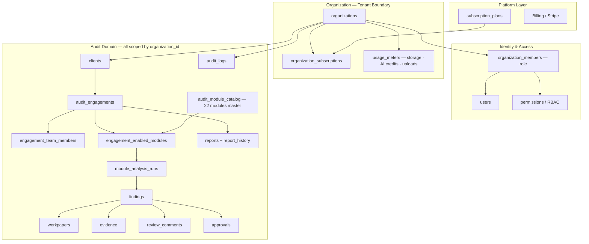
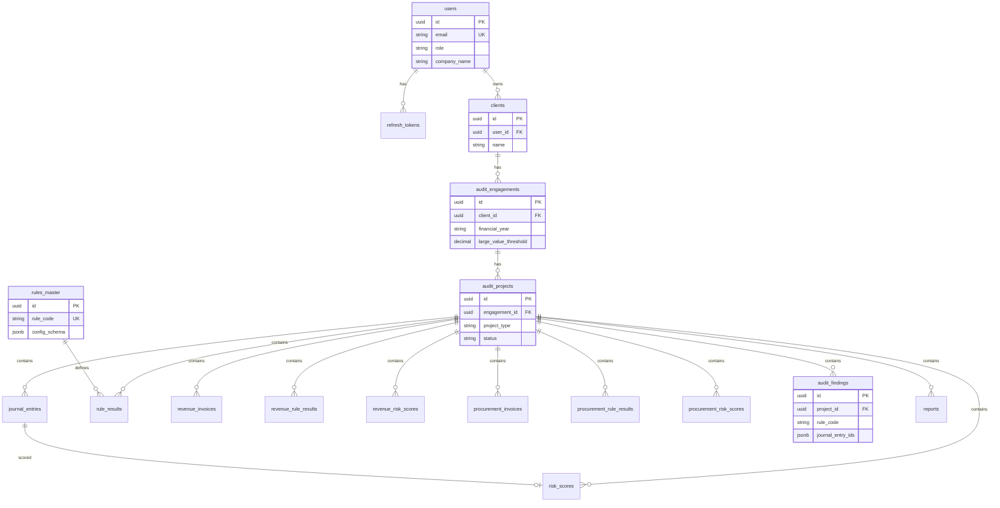
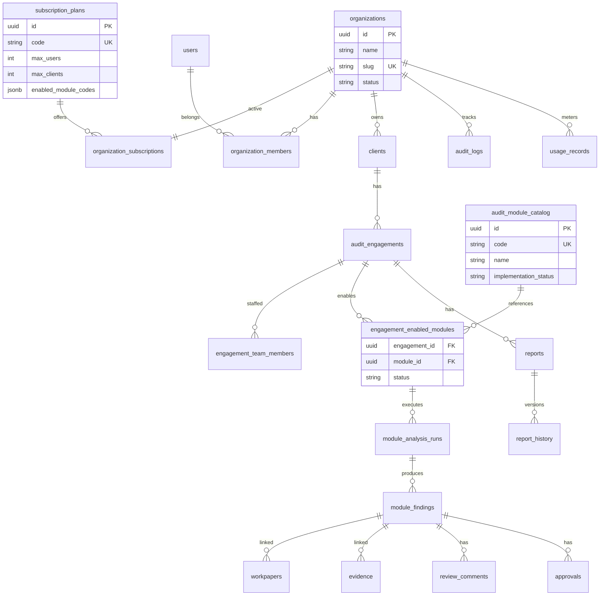

# AIML_AUDIT — Enterprise SaaS Architecture Review

**Document version:** 1.0  
**Date:** June 2026  
**Review type:** Read-only gap analysis (no code changes)  
**Codebase:** Next.js 14 frontend · FastAPI backend · PostgreSQL (6 Alembic migrations)  
**Target:** Multi-tenant subscription SaaS for 100–10,000+ audit firms

---

## Table of Contents

1. [Executive Summary](#executive-summary)
2. [Product Vision Reference](#product-vision-reference)
3. [Existing Architecture Diagram](#1-existing-architecture-diagram)
4. [Target SaaS Architecture Diagram](#2-target-saas-architecture-diagram)
5. [Existing Database ER Diagram](#3-existing-database-er-diagram-logical)
6. [Recommended SaaS ER Diagram](#4-recommended-saas-er-diagram-logical)
7. [Current vs Target Comparison Matrix](#5-current-vs-target-comparison-matrix)
8. [Tables Already Designed Correctly](#6-tables-already-designed-correctly)
9. [Tables That Need Modification](#7-tables-that-need-modification-additive-only)
10. [Missing Tables](#8-missing-tables)
11. [Missing Relationships](#9-missing-relationships)
12. [Missing APIs](#10-missing-apis)
13. [Missing Services](#11-missing-services)
14. [Missing Frontend Features](#12-missing-frontend-features)
15. [Missing Enterprise Features](#13-missing-enterprise-features)
16. [Readiness Scores](#14--15-readiness-scores)
17. [Detailed Migration Strategy](#16-detailed-migration-strategy)
18. [Phased Implementation Roadmap](#17-phased-implementation-roadmap)
19. [Future Maintenance & Scalability Risks](#18-future-maintenance--scalability-risks)
20. [Module Catalog Alignment (22 Modules)](#module-catalog-alignment-22-modules)
21. [Architectural Decisions for Approval](#architectural-decisions-for-approval)

---

## Executive Summary

AIML_AUDIT has a **solid analytics core** for three modules (Journal Entry, Revenue, Procurement) with a correct **Client → Engagement** hierarchy shape. It is architected today as a **single-user audit tool**, not a **multi-tenant SaaS platform**.

The largest structural mismatch with the target vision is **not missing features alone** — it is **two conflicting product models**:

| Dimension | Current | Target |
|---|---|---|
| Customer | Individual `User` | `Organization` (audit firm) |
| Data isolation | `Client.user_id` | `Organization` tenant boundary |
| Modules | 3 separate workstreams + 20-card catalog | **One catalog of 22 modules**, enabled per engagement |
| Project layer | `audit_projects` with `project_type` | Engagement **enables modules** directly |
| Subscription | Frontend types only | Plans drive limits and module entitlements |

### Readiness Scores

| Score | Value | Meaning |
|---|---:|---|
| **Enterprise Readiness** | **39 / 100** | Strong module analytics; weak governance/workflow |
| **SaaS Readiness** | **24 / 100** | Not safe for multi-firm subscription deployment today |

**Verdict:** Ready for demo / single-auditor pilot. **Not ready** for multi-tenant SaaS at scale without Phase 1 foundation work.

---

## Product Vision Reference

### SaaS Business Flow (Target)

```
Platform
  ↓
Subscription Plans
  ↓
Organizations (Audit Firms)
  ↓
Users
  ↓
Clients
  ↓
Audit Engagements
  ↓
Enabled Audit Modules
  ↓
Audit Findings
  ↓
Reports
  ↓
Workpapers
  ↓
Evidence
  ↓
Audit Logs
```

### Subscription Plans (Target)

Shared plans (Free, Starter, Professional, Enterprise) define:

- Maximum Users
- Maximum Clients
- Maximum Audit Engagements
- Maximum Storage
- Monthly AI Credits
- Monthly Upload Limits
- Enabled Audit Modules
- API Limits
- Support Level

Each organization has **one active subscription**.

### User Roles (Target)

- Organization Owner
- Partner
- Audit Manager
- Senior Auditor
- Auditor
- Reviewer
- Client User
- Read Only

### Module Model (Target)

- **One master catalog** of 22 AI Audit Modules (not duplicated)
- Engagements **enable** required modules from the catalog
- Journal Entry Testing, Revenue Testing, and Procurement Testing are **catalog modules**, not separate workstreams

### Every Module Should Eventually Support

- File Upload
- Rule Engine
- AI Analysis
- Risk Scoring
- Findings
- Workpapers
- Evidence Repository
- Review Comments
- Approval Workflow
- Reports
- Audit Logs
- Version History
- Executive Summary
- AI Recommendations

---

## 1. Existing Architecture Diagram

```mermaid
flowchart TB
    subgraph Frontend["Next.js Frontend"]
        LOGIN[Login / Register]
        DASH[Dashboard KPIs]
        NAV[Clients · Engagements · Projects · Rules · Reports]
        WS1[Journal Workspace]
        WS2[Revenue Workspace]
        WS3[Procurement Workspace]
        CAT[20-Module Catalog Grid]
    end

    subgraph Backend["FastAPI Backend v2.0"]
        AUTH[/auth/*]
        CRUD[/clients · /engagements · /projects]
        JE[/upload · /run-rules · /run-risk · /findings · /reports]
        REV[/revenue/*]
        PROC[/procurement/*]
        RULES[/rules · /rules_master]
    end

    subgraph Data["PostgreSQL — 17 tables"]
        U[users]
        U --> C[clients via user_id]
        C --> E[audit_engagements]
        E --> P[audit_projects project_type]
        P --> JE_DATA[journal_entries / rule_results / risk_scores]
        P --> REV_DATA[revenue_invoices / ...]
        P --> PROC_DATA[procurement_invoices / ...]
        P --> F[audit_findings]
        P --> R[reports]
        GLOBAL[rules_master — global]
    end

    LOGIN --> AUTH
    DASH --> Backend
    WS1 --> JE
    WS2 --> REV
    WS3 --> PROC
    Backend --> Data
```

**Access model today:** Every API checks `Client.user_id == current_user.id` (`backend/app/services/project_access.py`).

**Backend hierarchy documented in API:** Auditor → Clients → Engagements → Projects → Upload → Rules → Risk → Findings → Reports

---

## 2. Target SaaS Architecture Diagram



---

## 3. Existing Database ER Diagram (Logical)



### Existing Tables (17)

| # | Table | Purpose |
|---|-------|---------|
| 1 | `users` | Authentication, role string |
| 2 | `refresh_tokens` | JWT refresh rotation |
| 3 | `clients` | Audited entities (owned by user) |
| 4 | `audit_engagements` | FY engagements per client |
| 5 | `audit_projects` | Project per `project_type` |
| 6 | `journal_entries` | Journal upload data |
| 7 | `rules_master` | Global configurable rules |
| 8 | `rule_results` | Journal rule hits |
| 9 | `risk_scores` | Journal per-entry scores |
| 10 | `audit_findings` | Aggregated findings (shared) |
| 11 | `reports` | Export metadata + local path |
| 12 | `revenue_invoices` | Revenue upload data |
| 13 | `revenue_rule_results` | Revenue rule hits |
| 14 | `revenue_risk_scores` | Revenue per-invoice scores |
| 15 | `procurement_invoices` | Procurement upload data |
| 16 | `procurement_rule_results` | Procurement rule hits |
| 17 | `procurement_risk_scores` | Procurement per-invoice scores |

### Existing API Routers (13)

| Router | Prefix / paths |
|--------|----------------|
| `health` | `/health`, `/health/db` |
| `auth` | `/auth/register`, `/login`, `/refresh`, `/logout`, `/me` |
| `clients` | `/clients` CRUD |
| `engagements` | `/engagements` CRUD |
| `projects` | `/projects` CRUD |
| `upload` | `/upload` |
| `rules` | `/run-rules`, `/rule-results` |
| `rules_master` | `/rules` CRUD |
| `analytics` | `/run-risk`, `/risk-scores`, `/findings`, `/reports/*` |
| `revenue` | `/revenue/*` (6 endpoints) |
| `procurement` | `/procurement/*` (6 endpoints) |
| `dashboard` | `/dashboard/summary` |

---

## 4. Recommended SaaS ER Diagram (Logical)



**Note:** Existing transactional tables (`journal_entries`, `revenue_invoices`, etc.) should remain but link to `module_analysis_runs` and be tenant-scoped via `organization_id` (directly or via join).

---

## 5. Current vs Target Comparison Matrix

| Area | Current | Target | Alignment | Gap Summary | Why It Matters | Recommended Solution | Complexity |
|---|---|---|:---:|---|---|---|:---:|
| **Multi-tenancy** | User-owned clients | Organization tenant isolation | ✗ | No `organizations` table | Cross-firm data leak risk | Add `organizations` + tenant filters on all queries | High |
| **Subscription model** | UI types only | Plans with limits & entitlements | ✗ | No billing or enforcement | Cannot monetize SaaS | `subscription_plans`, `organization_subscriptions`, usage meters | High |
| **Organizations** | `User.company_name` text | Full org profile + settings | ✗ | No firm entity | Cannot onboard audit firms | `organizations` + admin API | High |
| **Users** | Flat users with role string | Org members with 8 role types | ⚠ | Roles not org-scoped | No collaboration or SoD | `organization_members` + permission matrix | High |
| **Clients** | `clients.user_id` | `clients.organization_id` | ⚠ | Hierarchy correct; wrong owner | Users can't share clients | Migrate FK to `organization_id` | Medium |
| **Audit engagements** | Full CRUD | + team, enabled modules, lifecycle | ⚠ | Basic engagement works | Missing team & module enablement | Extend + junction tables | Medium |
| **22-module catalog** | 20 in TS; 3 built | Single DB catalog of 22 | ⚠ | Frontend-only catalog | Can't entitle per plan | `audit_module_catalog` in PostgreSQL | Medium |
| **Module enablement** | `project_type` on projects | Engagement enables modules | ✗ | Workstream ≠ catalog model | Wrong SaaS UX | `engagement_enabled_modules` | High |
| **Rule engine** | 21 rules; global master | Per-module + firm overrides | ⚠ | Strong for 3 modules | Global rules leak across tenants | Scope `rules_master` by org | Medium |
| **Risk scoring** | Weighted sum; 3 tiers | + confidence, explainability | ⚠ | Works for analytics | Not enterprise AI | Add AI enrichment later | Low |
| **Findings** | Template text | + lifecycle, review, AI | ⚠ | No workflow | Can't manage exceptions | Status, assignee, history | Medium |
| **Reports** | Excel/PDF; local disk | Versioned, branded | ⚠ | Ephemeral storage | Lost on redeploy | Blob storage + `report_history` | Medium |
| **Workpapers** | Excel filename only | Structured index | ✗ | No entity | Core deliverable missing | `workpapers` table | High |
| **Evidence** | None | Repository with hash | ✗ | No linkage | ISA 500 gap | `evidence` + S3 | High |
| **Review workflow** | UI label only | Threaded comments | ✗ | No review model | Preparer/reviewer gap | `review_comments` | High |
| **Approval workflow** | None | Sign-off chain | ✗ | No approvals | Can't close engagements | `approvals` | High |
| **Audit logs** | None | Immutable tenant log | ✗ | No trail | Compliance blocker | `audit_logs` + middleware | High |
| **Dashboard** | Journal-focused KPIs | Cross-module executive view | ⚠ | Incomplete scope | Partner visibility gap | Org-scoped dashboard v2 | Medium |
| **Authentication** | JWT + refresh | + SSO, MFA | ⚠ | Solid base | Enterprise IT reqs | MFA/SSO; org in JWT | Medium |
| **RBAC** | Role on user; same access | Permission matrix | ✗ | Not enforced | SoD impossible | Policy on `organization_members` | High |
| **Performance** | Sync HTTP | Async jobs, caching | ⚠ | OK for demo | Timeouts at scale | Job queue | Medium |
| **Scalability** | Single instance | Horizontal workers | ⚠ | Monolith pilot | 10,000 firms need scale | Tenant workers + blob | High |
| **Security** | bcrypt, JWT, CORS | + rate limit, audit | ⚠ | Basics present | SaaS gaps | Hardening layer | Medium |
| **Database design** | 17 analytics tables | + governance + tenancy | ⚠ | Missing SaaS layer | Unsafe multi-firm | Additive schema | High |
| **API design** | Per-module routers | Unified module API | ⚠ | `/revenue/*`, `/procurement/*` | 22 routers unsustainable | `/modules/{code}/*` | High |
| **UI design** | 3 workstream pages | Engagement module launcher | ⚠ | Conflicts with target | Wrong navigation model | Engagement hub refactor | High |

**Legend:** ✓ Fully Aligned · ⚠ Partially Aligned · ✗ Not Aligned

---

## 6. Tables Already Designed Correctly

Keep and extend (do not rename):

| Table | Why Correct |
|---|---|
| `clients` | Correct audited-entity concept; add `organization_id` |
| `audit_engagements` | Correct engagement model; add team + module enablement |
| `journal_entries` | Correct JE population store |
| `revenue_invoices` | Correct Revenue population store |
| `procurement_invoices` | Correct Procurement population store |
| `rule_results` / `*_rule_results` | Correct rule-hit pattern |
| `risk_scores` / `*_risk_scores` | Correct per-line scoring pattern |
| `audit_findings` | Correct aggregate; extend with lifecycle |
| `reports` | Correct metadata index; extend with versioning |
| `rules_master` | Good rule registry; scope per tenant later |
| `refresh_tokens` | Standard session pattern |
| `users` | Valid identity; decouple from data ownership |

---

## 7. Tables That Need Modification (Additive Only)

Per review constraint: **do not rename existing tables**. Recommended additive changes:

| Table | Modification | Reason |
|---|---|---|
| `users` | Add optional `default_organization_id` | Link user to firm |
| `clients` | Add `organization_id`; eventually deprecate `user_id` | Tenant ownership |
| `audit_engagements` | Add `organization_id`, workflow status, `assigned_partner_id` | Tenant + workflow |
| `audit_projects` | Keep for backward compat; stop creating project-per-module | Conflicts with enabled modules |
| `audit_findings` | Add `status`, `assigned_to`, `organization_id`, `engagement_id`, `module_code` | Lifecycle + tenant |
| `reports` | Add `organization_id`, `engagement_id`, `version`, `storage_key` | SaaS reporting |
| `rules_master` | Add nullable `organization_id` (NULL = platform default) | Per-firm overrides |

---

## 8. Missing Tables

| Table | Purpose | Priority |
|---|---|:---:|
| `subscription_plans` | Plan definitions (Free/Starter/Pro/Enterprise) | P1 |
| `organization_subscriptions` | One active sub per org | P1 |
| `organizations` | Audit firm tenant | P1 |
| `organization_members` | User ↔ org ↔ role | P1 |
| `permissions` / `role_permissions` | RBAC matrix | P1 |
| `audit_module_catalog` | Master 22-module registry | P1 |
| `engagement_enabled_modules` | Modules enabled per engagement | P1 |
| `engagement_team_members` | Team assignment | P1 |
| `audit_logs` | Immutable activity trail | P1 |
| `usage_records` | Storage, AI credits, uploads | P1 |
| `module_analysis_runs` | Job tracking per module run | P2 |
| `workpapers` | Workpaper index & references | P2 |
| `evidence` | File metadata, hash, storage key | P2 |
| `evidence_links` | evidence ↔ finding ↔ transaction | P2 |
| `review_comments` | Threaded review | P2 |
| `approvals` | Sign-off records | P2 |
| `finding_status_history` | Exception lifecycle audit | P2 |
| `report_templates` | Firm-branded layouts | P3 |
| `report_history` | Report version control | P3 |
| `ai_recommendations` | LLM outputs with confidence | P3 |
| `notifications` | User alerts | P3 |
| `materiality_settings` | Per-engagement thresholds | P3 |
| `audit_samples` | Sampling methodology records | P3 |

---

## 9. Missing Relationships

| Relationship | Current | Target |
|---|---|---|
| Organization → Users | ✗ | 1:N via `organization_members` |
| Organization → Clients | ✗ (via User) | 1:N direct |
| Plan → Organizations | ✗ | N:1 via subscription |
| Engagement → Enabled modules | ✗ | N:M via `engagement_enabled_modules` |
| Engagement → Team | ✗ | N:M via `engagement_team_members` |
| Module catalog → Rules | Loose (global) | Module-scoped rule sets |
| Finding → Evidence | ✗ | N:M via `evidence_links` |
| Finding → Workpaper | ✗ | N:1 or N:M |
| Finding → Review comments | ✗ | 1:N |
| Finding → Approvals | ✗ | 1:N |
| Organization → Audit logs | ✗ | 1:N |

---

## 10. Missing APIs

| API Group | Status |
|---|---|
| `/organizations/*` | ✗ Missing |
| `/subscriptions/*` | ✗ Missing |
| `/organizations/{id}/members/*` | ✗ Missing |
| `/modules/catalog` | ✗ Missing |
| `/engagements/{id}/modules/*` | ✗ Missing |
| `/engagements/{id}/team/*` | ✗ Missing |
| `/evidence/*` | ✗ Missing |
| `/workpapers/*` | ✗ Missing |
| `/findings/{id}/comments/*` | ✗ Missing |
| `/findings/{id}/approve` | ✗ Missing |
| `/audit-logs/*` | ✗ Missing |
| `/usage/*` | ✗ Missing |
| `/analysis/runs/*` | ✗ Missing |
| Generic `/modules/{code}/*` | ✗ Missing |
| `/dashboard/org-summary` | ✗ Missing |
| `/notifications/*` | ✗ Missing |

### Existing APIs (~45 endpoints — keep)

- Auth: register, login, refresh, logout, me
- CRUD: clients, engagements, projects
- Journal: upload, run-rules, run-risk, risk-scores, findings, reports
- Revenue: `/revenue/*` (6 endpoints)
- Procurement: `/procurement/*` (6 endpoints)
- Rules master: list, get, patch
- Dashboard: summary

---

## 11. Missing Services

| Service | Status |
|---|---|
| `TenantContextService` | ✗ |
| `SubscriptionService` | ✗ |
| `ModuleCatalogService` | ✗ |
| `EngagementModuleService` | ✗ |
| `AuditLogService` | ✗ |
| `EvidenceStorageService` | ✗ |
| `WorkpaperService` | ✗ |
| `ReviewWorkflowService` | ✗ |
| `JobQueueService` | ✗ |
| `UsageMeteringService` | ✗ |
| `AIService` | ✗ |
| `NotificationService` | ✗ |
| `ConsolidatedReportService` | ✗ |

### Existing Services (keep)

- `rule_engine`, `revenue_rule_engine`, `procurement_rule_engine`
- `risk_scoring` (+ revenue/procurement variants)
- `findings_service` (+ revenue/procurement variants)
- `report_export`, `upload_service` (+ variants)
- `auth_service`, `project_access` (refactor to tenant access)

---

## 12. Missing Frontend Features

| Feature | Status |
|---|---|
| Organization onboarding / firm setup | ✗ |
| Subscription plan selection & upgrade | ✗ |
| Firm admin: invite users, assign roles | ✗ |
| Engagement module enablement UI | ✗ |
| Engagement team assignment UI | ✗ |
| Module launcher (enabled modules only) | ✗ |
| Evidence upload & viewer | ✗ |
| Workpaper browser | ✗ |
| Review comments on findings | ✗ |
| Approval / sign-off UI | ✗ |
| Audit log viewer | ✗ |
| Usage dashboard (storage, credits) | ✗ |
| Client portal (Client User role) | ✗ |
| Next.js middleware auth | ✗ |
| Role-gated navigation | ✗ |
| Generic module workspace | ✗ |
| Route error/loading boundaries | ✗ |
| Notification center | ✗ |

### Existing Frontend (keep)

- Login / register / forgot password
- Dashboard KPIs + charts
- Clients, engagements, projects CRUD
- Rules editor
- 3 full module workspaces (Journal, Revenue, Procurement)
- Reports list, settings profile
- 20-module catalog grid (AI Audit Modules page)

---

## 13. Missing Enterprise Features

| Feature | Status |
|---|---|
| Multi-tenancy | ✗ |
| Subscription management | ✗ |
| RBAC (enforced) | ✗ |
| Audit trail | ✗ |
| Workpaper management | ✗ |
| Evidence repository | ✗ |
| Review workflow | ✗ |
| Approval workflow | ✗ |
| Finding lifecycle | ✗ |
| Materiality | ⚠ threshold on engagement only |
| Sampling | ✗ |
| AI recommendations (real LLM) | ✗ |
| AI narratives | ✗ |
| Executive dashboard | ⚠ partial |
| Consolidated reporting | ✗ |
| Notifications | ✗ |
| Version control | ✗ |
| MFA / SSO | ✗ |
| Session timeout | ✗ |
| Server password policies | ✗ |

---

## 14 & 15. Readiness Scores

### Enterprise Readiness: 39 / 100

| Pillar | Score |
|---|---:|
| Audit analytics (3 modules) | 58 |
| Workflow & governance | 12 |
| Reporting & workpapers | 35 |
| Security & compliance | 32 |
| AI capabilities | 10 |
| Testing & ops | 22 |

### SaaS Readiness: 24 / 100

| Pillar | Score |
|---|---:|
| Multi-tenancy | 8 |
| Subscription & billing | 5 |
| Org + multi-user model | 15 |
| Module catalog & enablement | 20 |
| Tenant data isolation | 12 |
| Scalability to 10,000 firms | 18 |
| Usage metering | 0 |

---

## 16. Detailed Migration Strategy

### Guiding Principles

1. **Additive schema only** — no table renames; new tables + nullable FKs first.
2. **Strangler pattern** — new SaaS layer wraps existing APIs; deprecate workstreams gradually.
3. **Dual-write period** — populate `organization_id` while keeping `user_id` working.
4. **Don't break 3 live modules** — Journal/Revenue/Procurement keep working throughout.
5. **Catalog becomes source of truth** — move `lib/dashboard/modules.ts` → DB; frontend reads API.

### Migration Steps

**Step A — Introduce tenant layer**

- Create `organizations`, `organization_members`, `subscription_plans`, `organization_subscriptions`
- On register: create org + owner membership
- Backfill: one org per existing user; set `clients.organization_id`

**Step B — Switch access control**

- New `get_tenant_context()` replaces user-only checks
- All queries add `WHERE organization_id = :tenant_id`
- JWT includes `org_id` + `member_role`

**Step C — Module model shift**

- Create `audit_module_catalog` (22 rows)
- Create `engagement_enabled_modules`
- Map existing `audit_projects.project_type` → enabled module records
- New engagements: enable modules, not create 3 fixed projects

**Step D — Governance layer**

- Add workpapers, evidence, review_comments, approvals, audit_logs
- Wire into existing findings flow

**Step E — Subscription enforcement**

- Gate upload/analysis on plan limits and enabled modules
- Meter usage on each run

### Catalog Count Reconciliation

| Source | Count |
|---|---:|
| Target architecture document | **22 modules** |
| `lib/dashboard/modules.ts` today | **20 modules** |
| Gap | **Inventory Testing** (+ align numbering) |

---

## 17. Phased Implementation Roadmap

### Phase 1 — SaaS Foundation (Critical) · ~10–14 weeks

**Goal:** Safe multi-tenant platform for pilot firms

| # | Deliverable |
|---|---|
| 1 | `organizations`, `organization_members`, `subscription_plans`, `organization_subscriptions` |
| 2 | Tenant-scoped queries on clients, engagements, all module data |
| 3 | `audit_module_catalog` (22 modules) + seed data |
| 4 | `engagement_enabled_modules` + admin UI |
| 5 | JWT with `organization_id`; RBAC on members |
| 6 | `audit_logs` on all mutations |
| 7 | Subscription limit checks (users, clients, uploads) |
| 8 | Migrate demo + production data to org model |

**Exit criteria:** Two users at same firm share clients; Firm A cannot see Firm B.

---

### Phase 2 — Enterprise Audit Workflow · ~10–12 weeks

**Goal:** Big4-style engagement execution

| # | Deliverable |
|---|---|
| 1 | `engagement_team_members` + assignment UI |
| 2 | `workpapers`, `evidence`, `evidence_links` |
| 3 | Finding lifecycle (Open → In Review → Cleared / Accepted) |
| 4 | `review_comments`, `approvals` |
| 5 | Async `module_analysis_runs` (job queue) |
| 6 | Blob storage for reports & evidence |
| 7 | Engagement-centric module launcher |
| 8 | Consolidated engagement report |

**Exit criteria:** Evidence attached, reviewer comments, partner approves, audit log complete.

---

### Phase 3 — Scale, AI & Remaining Modules · ~12–16 weeks

**Goal:** 100+ firms, module expansion, AI differentiation

| # | Deliverable |
|---|---|
| 1 | Generic module plugin architecture (`/modules/{code}/*`) |
| 2 | Build modules 4–22 incrementally |
| 3 | `ai_recommendations`, LLM narratives, executive summaries |
| 4 | `usage_records`, AI credit metering |
| 5 | Executive firm dashboard |
| 6 | MFA + SSO (Azure AD) |
| 7 | `notifications` |
| 8 | Materiality + sampling framework |
| 9 | Full test suite + CI/CD |
| 10 | Read replicas, caching, horizontal workers |

**Exit criteria:** New module added via catalog row + rule pack, not new router clone.

---

## 18. Future Maintenance & Scalability Risks

| Risk | Current Cause | Future Impact | Mitigation |
|---|---|---|---|
| Per-module router duplication | `/revenue/*`, `/procurement/*` | 22 modules unmaintainable | Generic `/modules/{code}/*` |
| Per-module DB tables | Separate tables per module | Schema explosion | Abstract interface + module schemas |
| Frontend workspace triplication | 3 × ~280-line workspaces | 22× duplication | Shared `AuditModuleWorkspace` |
| Global `rules_master` | Shared across users | Tenant config leakage | Org-scoped overrides |
| User-owned clients | `clients.user_id` | Blocks SaaS | Org ownership migration |
| Project-per-module-type | Conflicts with enablement | UX confusion | Deprecate user-facing projects |
| Local report storage | `generated_reports/` on disk | Lost on redeploy | S3 from Phase 2 |
| Sync analysis in HTTP | No job queue | Timeouts at scale | Background workers |
| Findings field misuse | `journal_entry_ids` stores invoice UUIDs | Audit confusion | Add `affected_entity_ids` |
| Catalog in TypeScript only | `modules.ts` not in DB | Plan entitlements can't drive UI | DB catalog + API |
| No tenant in JWT | User-only token | Fragile tenant resolution | Add `org_id` claim early |
| Dashboard journal-only | Scoped to JE metrics | Wrong executive view | Org cross-module dashboard |

---

## Module Catalog Alignment (22 Modules)

| # | Module | Implementation Today | Target |
|---|--------|----------------------|--------|
| 1 | Journal Entry Testing | **Full backend + UI** | Catalog module |
| 2 | Revenue Testing | **Full backend + UI** | Catalog module |
| 3 | Procurement Testing | **Full backend + UI** | Catalog module |
| 4 | Ledger Scrutiny | Placeholder page | Enable per engagement |
| 5 | Duplicate Payment Checking | Placeholder page | Enable per engagement |
| 6 | Bank Reconciliation | Coming Soon | Enable when built |
| 7 | Purchase Order Matching | Coming Soon | Enable when built |
| 8 | Vendor Invoice Validation | Coming Soon | Enable when built |
| 9 | Expense Claim Verification | Coming Soon | Enable when built |
| 10 | Fixed Asset Verification | Coming Soon | Enable when built |
| 11 | Depreciation Recalculation | Coming Soon | Enable when built |
| 12 | TDS Deduction Checking | Coming Soon | Enable when built |
| 13 | GST Mismatch Checking | Coming Soon | Enable when built |
| 14 | GST Input Tax Credit Validation | Coming Soon | Enable when built |
| 15 | Customer Balance Confirmation Tracking | Coming Soon | Enable when built |
| 16 | Payroll Audit Checking | Coming Soon | Enable when built |
| 17 | User Access Review | Coming Soon | Enable when built |
| 18 | Segregation of Duties Checking | Coming Soon | Enable when built |
| 19 | Compliance Checklist Verification | Coming Soon | Enable when built |
| 20 | Supporting Document Matching | Coming Soon | Enable when built |
| 21 | Exception Report Preparation | Coming Soon | Enable when built |
| 22 | Invoice Checking | Coming Soon | Enable when built |

**Note:** Codebase `lib/dashboard/modules.ts` currently lists **20 modules**. Target document specifies **22** — add **Inventory Testing** and reconcile numbering when implementing `audit_module_catalog`.

### Implemented Audit Rules (21)

**Journal (7):** `LARGE_VALUE`, `YEAR_END`, `ROUND_AMOUNT`, `WEEKEND`, `SUSPENSE_ACCOUNT`, `MANUAL_JOURNAL`, `UNUSUAL_POSTING`

**Revenue (7):** `REV_DUPLICATE_INVOICE`, `REV_CUTOFF`, `REV_GST_MISMATCH`, `REV_ROUND_AMOUNT`, `REV_HIGH_VALUE`, `REV_MISSING_GSTIN`, `REV_UNPAID_LARGE`

**Procurement (7):** `PROC_DUPLICATE_PAYMENT`, `PROC_MISSING_PO`, `PROC_GST_MISMATCH`, `PROC_HIGH_VALUE`, `PROC_ROUND_AMOUNT`, `PROC_MISSING_GSTIN`, `PROC_CUTOFF`

---

## Architectural Decisions for Approval

Before implementation, confirm:

| # | Decision | Option A (Recommended) | Option B |
|---|----------|------------------------|----------|
| 1 | Tenant entity | `organizations` table | Keep user-as-tenant |
| 2 | Module binding | Engagement enables catalog modules | Keep `audit_projects.project_type` |
| 3 | Module API | Generic `/modules/{code}/*` over time | Keep per-module routers |
| 4 | Existing `audit_projects` | Keep for compat; hide from users | Remove (blocked: no rename policy) |
| 5 | Catalog source | PostgreSQL `audit_module_catalog` | Keep TypeScript only |
| 6 | Migration approach | Additive + dual-write | Big-bang rewrite |

---

## Document Status

| Item | Value |
|---|---|
| Code modified | **No** |
| Migrations created | **No** |
| Implementation started | **No** |
| Awaiting approval | **Yes** — Phase 1 + architectural decisions |

---

*Generated from codebase review of AIML_AUDIT (`auditai-login`). For deployment details see `DEPLOYMENT.md`. For backend API see `backend/README.md`.*
