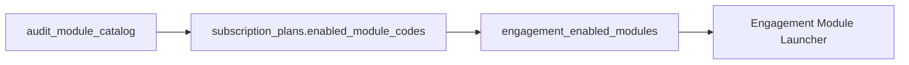

================================================================
SOURCE FILE: docs/adr/ADR-003-Tenant-Isolation.md
================================================================
# ADR-003: Tenant Isolation via organization_id

## Status

**Accepted** — June 2026

## Context

Multi-tenant SaaS requires that Firm A cannot access Firm B's data—even by guessing UUIDs. Current implementation in `project_access.py` validates ownership via:

```
Client.user_id == current_user.id
```

This is user-scoped, not firm-scoped. A second auditor at the same firm sees zero clients. A malicious user with a valid token could potentially access another user's resources if they obtain a UUID.

Target: support 100–10,000+ audit firms with zero cross-tenant data leaks.

## Decision

Apply **shared-database, shared-schema multi-tenancy** with `organization_id` on all tenant-scoped tables. Every API query and mutation must filter by the authenticated user's current organization.

Implementation pattern:

1. JWT includes `org_id` and `member_role`
2. `TenantContext` middleware resolves org from token
3. All list/get/update/delete operations add `WHERE organization_id = :org_id`
4. Integration tests verify Firm A token cannot read Firm B resources

Row-level security (PostgreSQL RLS) is optional enhancement in Phase 3; application-layer checks are sufficient for Phase 1.

## Consequences

### Positive

- Industry-standard pattern; well understood by developers
- Single database simplifies operations and reporting
- Additive migration: nullable `organization_id` → backfill → NOT NULL
- Compatible with existing UUID primary keys

### Negative

- Every new table must include `organization_id` (discipline required)
- Forgotten filter = security vulnerability (mitigate with tests + code review)
- Platform-admin cross-tenant views need separate bypass role

## Alternatives Considered

| Alternative | Why rejected |
|-------------|--------------|
| Database per tenant | 10,000 databases impractical on Railway/single ops team |
| Schema per tenant | Migration complexity multiplied by tenant count |
| PostgreSQL RLS only | Harder to debug; still need org_id column; defer to Phase 3 |
| Application-level user_id only | Does not support team collaboration |

## Related Documents

- [../architecture/03_MULTI_TENANT_ARCHITECTURE.md](../architecture/03_MULTI_TENANT_ARCHITECTURE.md)
- [ADR-001-Organizations.md](./ADR-001-Organizations.md)
- [../database/04_MIGRATION_STRATEGY.md](../database/04_MIGRATION_STRATEGY.md)

================================================================
SOURCE FILE: docs/adr/ADR-006-Migration-Strategy.md
================================================================
# ADR-006: Additive Database Migration Strategy

## Status

**Accepted** — June 2026

## Context

Production database on Railway contains demo and pilot data across 17 tables with 6 Alembic migrations (001–006). SaaS transformation requires new tables (`organizations`, `subscription_plans`, `audit_module_catalog`, etc.) and new columns (`organization_id` on `clients`, `audit_engagements`).

Renaming or dropping existing tables would break the 3 working audit modules and require coordinated frontend/backend downtime.

## Decision

Use **additive-only migrations**:

1. **CREATE** new tables; never DROP existing tables in Phase 1–2
2. **ADD** nullable columns first; backfill; then ADD NOT NULL constraint in separate migration
3. **KEEP** `audit_projects` and all module-specific data tables unchanged
4. **BACKFILL** script: each existing user → new organization; copy `user_id` ownership to `organization_id`
5. **Alembic** remains migration tool; one migration per logical change
6. **No table renames** until Phase 3 generic API is stable

Rollback strategy: new columns/tables can be ignored by old code; feature flag `USE_ORG_TENANCY` controls which code path runs.

## Consequences

### Positive

- Zero downtime deployment possible
- Existing Journal/Revenue/Procurement flows unaffected during migration
- Rollback = disable feature flag, not database restore
- Clear audit trail via Alembic version history

### Negative

- Temporary schema complexity (old + new columns coexist)
- Backfill must be idempotent and tested on staging clone
- Discipline required to avoid destructive migrations under pressure

## Alternatives Considered

| Alternative | Why rejected |
|-------------|--------------|
| Greenfield database | Loses production data; duplicate ops burden |
| Big-bang schema rewrite | Unacceptable downtime and regression risk |
| Rename clients → organizations | Wrong semantics; clients are auditees |
| Manual SQL without Alembic | No version tracking; team coordination failure |

## Related Documents

- [../database/04_MIGRATION_STRATEGY.md](../database/04_MIGRATION_STRATEGY.md)
- [../database/01_DATABASE_DESIGN.md](../database/01_DATABASE_DESIGN.md)
- [../roadmap/PHASE1_SAAS_FOUNDATION.md](../roadmap/PHASE1_SAAS_FOUNDATION.md)

================================================================
SOURCE FILE: docs/database/01_DATABASE_DESIGN.md
================================================================
# 01 — Database Design

## Purpose

Document the current PostgreSQL schema, design principles, indexes, and the target SaaS schema extensions.

## Current Design Principles

- Single schema (`public`) in PostgreSQL
- SQLAlchemy ORM models in one file: `backend/app/models/audit.py`
- Alembic for migrations (7 versions: 001–007)
- JSONB for flexible rule config and finding entity references
- Cascade deletes from engagement → project → transactional data

## Current Tables (18)

| # | Table | Primary purpose |
|---|-------|-----------------|
| 1 | `users` | Identity, role string, profile, `default_organization_id` (interim) |
| 2 | `organizations` | Audit firm tenant *(Phase 1 M1)* |
| 3 | `refresh_tokens` | JWT refresh rotation |
| 4 | `clients` | Audited entities (`user_id` owner) |
| 5 | `audit_engagements` | FY engagements per client |
| 6 | `audit_projects` | Module instance via `project_type` |
| 7 | `journal_entries` | JE upload population |
| 8 | `rules_master` | Global rule definitions |
| 9 | `rule_results` | Journal rule violations |
| 10 | `risk_scores` | Journal entry scores |
| 11 | `audit_findings` | Aggregated findings (all modules) |
| 12 | `reports` | Export file metadata |
| 13 | `revenue_invoices` | Revenue upload population |
| 14 | `revenue_rule_results` | Revenue rule violations |
| 15 | `revenue_risk_scores` | Revenue invoice scores |
| 16 | `procurement_invoices` | Procurement upload population |
| 17 | `procurement_rule_results` | Procurement rule violations |
| 18 | `procurement_risk_scores` | Procurement invoice scores |

## Migration History

| Version | File | Summary |
|---------|------|---------|
| 001 | `001_initial_schema.py` | users, journal_entries, rules, findings |
| 002 | `002_hierarchy_and_rules.py` | clients, engagements, projects, rules_master seed |
| 003 | `003_refresh_tokens.py` | refresh token table |
| 004 | `004_rule_config_defaults.py` | rule config_schema backfill |
| 005 | `005_revenue_testing.py` | revenue tables + REV_* rules |
| 006 | `006_procurement_testing.py` | procurement tables + PROC_* rules |
| 007 | `007_organizations.py` | organizations + users.default_organization_id |

### `organizations` (Milestone 1)

| Column | Type | Notes |
|--------|------|-------|
| `id` | UUID PK | |
| `name` | varchar(255) | Firm legal/trading name |
| `slug` | varchar(100) UK | URL-safe unique identifier |
| `status` | varchar(50) | `active`, `suspended`, `closed` |
| `settings` | JSONB | Timezone, branding, defaults |
| `created_at`, `updated_at` | timestamptz | |

## Key Columns

### `audit_projects.project_type`

Values in use: `journal_testing`, `revenue_testing`, `procurement_testing`

### `audit_findings.journal_entry_ids`

JSONB array of UUIDs — stores journal entry IDs **or** invoice IDs (revenue/procurement). Naming debt.

### `rules_master`

Global table; 21 rule codes across JE + revenue + procurement. Configurable via `config_schema` JSONB.

## Indexes (from migrations)

- `users.email` (unique)
- `clients.user_id`
- `audit_engagements.client_id`
- `audit_projects.engagement_id`
- `journal_entries.project_id`, `posting_date`
- `rule_results.project_id`
- `risk_scores.project_id` (+ unique project+entry)
- `audit_findings.project_id`
- `reports.project_id`
- Revenue/procurement invoice `project_id`

**Gaps:** No index on `rule_code`, `risk_category`, `procurement_rule_results.project_id`

## Current Implementation

- Connection pool: `pool_size=5`, `max_overflow=10`
- No row-level security (RLS) in PostgreSQL
- Tenant isolation via application code only

## Future Design (Additive)

See [02_ER_DIAGRAM.md](./02_ER_DIAGRAM.md) and approved decisions:

| New table group | Purpose |
|-----------------|---------|
| Platform | `subscription_plans`, `organization_subscriptions` |
| Tenancy | `organizations`, `organization_members` |
| Catalog | `audit_module_catalog`, `engagement_enabled_modules` |
| Governance | `audit_logs`, `workpapers`, `evidence`, `review_comments`, `approvals` |
| Operations | `module_analysis_runs`, `usage_records`, `report_history` |

### Additive column changes

- `clients.organization_id`
- `audit_engagements.organization_id`
- `audit_findings.status`, `module_code`, `organization_id`
- `rules_master.organization_id` (nullable)

## Advantages (Current)

- Normalized analytics schema
- Clear project-scoped data for three modules
- Migration chain is linear and reproducible

## Disadvantages (Current)

- No tenant column — SaaS blocker
- Per-module table triplication (journal/revenue/procurement)
- Global rules_master shared across all users
- `audit_projects` conflicts with engagement-enabled modules target

## Migration Strategy

**Additive only. No table renames.**

1. New SaaS tables (no changes to existing)
2. Nullable FKs + backfill
3. Dual-write period
4. Deprecate `user_id` on clients (do not drop in Phase 1)

See [04_MIGRATION_STRATEGY.md](./04_MIGRATION_STRATEGY.md).

## Risks

| Risk | Impact |
|------|--------|
| 22 modules = 22 table groups | Schema sprawl |
| Finding ID field misuse | Reporting errors |
| Missing tenant index | Slow queries at scale |

## Recommendations

1. Introduce `audit_module_catalog` before module #4
2. Add generic `affected_entity_ids` on findings (keep old column)
3. Plan module data abstraction before building modules 4–10

---

*Related: [03_TABLE_RELATIONSHIPS.md](./03_TABLE_RELATIONSHIPS.md)*

================================================================
SOURCE FILE: docs/adr/ADR-002-Module-Catalog.md
================================================================
# ADR-002: Module Catalog in PostgreSQL

## Status

**Accepted** — June 2026

## Context

AIML_AUDIT offers 22 AI audit modules (Journal Entry Testing, Revenue Testing, Procurement Testing, and 19 planned modules). Currently:

- **3 modules** are fully implemented end-to-end (backend rules, upload, risk, findings)
- **20 modules** are listed in frontend `lib/dashboard/modules.ts` with hardcoded status
- Module enablement per engagement is not persisted
- Subscription plans cannot gate module access

The business requires ONE master catalog where modules are standard products—not separate workstreams—and engagements enable only required modules.

## Decision

Store the module catalog in PostgreSQL as `audit_module_catalog` with seed data for all 22 modules. Track per-engagement enablement in `engagement_enabled_modules`. Subscription plans reference allowed modules via `subscription_plan_modules` (or JSONB `enabled_modules` on plan row).

Frontend `modules.ts` becomes a **read-through cache** of API data, not the source of truth.

## Consequences

### Positive

- Single source of truth for module metadata (name, code, category, status)
- Subscription and engagement gating enforced server-side
- New modules added via migration seed + plugin registration
- Consistent module list across web, API, and future mobile clients

### Negative

- Initial seed migration required for 22 modules
- Frontend must fetch catalog on load (cache strategy needed)
- Module `status` transitions (planned → beta → active) require DB updates

## Alternatives Considered

| Alternative | Why rejected |
|-------------|--------------|
| Keep frontend-only catalog | Cannot enforce subscription limits; drift between UI and backend |
| JSON config file in repo | No runtime updates; no per-org overrides |
| Separate microservice for catalog | Over-engineered for 22 static modules |
| One table per module type | Does not scale to 22 modules; duplicates schema |

## Related Documents

- [../business/03_MODULE_CATALOG.md](../business/03_MODULE_CATALOG.md)
- [ADR-004-Module-Enablement.md](./ADR-004-Module-Enablement.md)
- [../api/03_FUTURE_GENERIC_MODULE_API.md](../api/03_FUTURE_GENERIC_MODULE_API.md)

================================================================
SOURCE FILE: docs/business/03_MODULE_CATALOG.md
================================================================
# 03 — Module Catalog

## Purpose

Define the single master catalog of 22 AI Audit Modules, implementation status, and enablement model.

## Approved Decisions

- **One catalog** — modules are not duplicated per firm
- **Store catalog in PostgreSQL** (`audit_module_catalog`)
- Journal, Revenue, Procurement are **standard catalog modules**, not separate workstreams
- Engagements **enable** modules from the catalog

See [../adr/ADR-002-Module-Catalog.md](../adr/ADR-002-Module-Catalog.md).

## Master Catalog (22 Modules)

| # | Module | Catalog code (proposed) | Status | Backend | Frontend |
|---|--------|-------------------------|--------|:---:|:---:|
| 1 | Journal Entry Testing | `JOURNAL_ENTRY_TESTING` | **Built** | ✓ | ✓ |
| 2 | Revenue Testing | `REVENUE_TESTING` | **Built** | ✓ | ✓ |
| 3 | Procurement Testing | `PROCUREMENT_TESTING` | **Built** | ✓ | ✓ |
| 4 | Ledger Scrutiny | `LEDGER_SCRUTINY` | Planned | ✗ | Stub |
| 5 | Duplicate Payment Checking | `DUPLICATE_PAYMENT` | Planned | ✗ | Stub |
| 6 | Bank Reconciliation | `BANK_RECONCILIATION` | Planned | ✗ | Coming Soon |
| 7 | Purchase Order Matching | `PO_MATCHING` | Planned | ✗ | Coming Soon |
| 8 | Vendor Invoice Validation | `VENDOR_INVOICE` | Planned | ✗ | Coming Soon |
| 9 | Expense Claim Verification | `EXPENSE_CLAIM` | Planned | ✗ | Coming Soon |
| 10 | Fixed Asset Verification | `FIXED_ASSET` | Planned | ✗ | Coming Soon |
| 11 | Depreciation Recalculation | `DEPRECIATION` | Planned | ✗ | Coming Soon |
| 12 | TDS Deduction Checking | `TDS_CHECKING` | Planned | ✗ | Coming Soon |
| 13 | GST Mismatch Checking | `GST_MISMATCH` | Planned | ✗ | Coming Soon |
| 14 | GST Input Tax Credit Validation | `GST_ITC` | Planned | ✗ | Coming Soon |
| 15 | Customer Balance Confirmation | `CUSTOMER_BALANCE` | Planned | ✗ | Coming Soon |
| 16 | Payroll Audit Checking | `PAYROLL` | Planned | ✗ | Coming Soon |
| 17 | User Access Review | `USER_ACCESS` | Planned | ✗ | Coming Soon |
| 18 | Segregation of Duties | `SOD` | Planned | ✗ | Coming Soon |
| 19 | Compliance Checklist | `COMPLIANCE` | Planned | ✗ | Coming Soon |
| 20 | Supporting Document Matching | `DOC_MATCHING` | Planned | ✗ | Coming Soon |
| 21 | Exception Report Preparation | `EXCEPTION_REPORT` | Planned | ✗ | Coming Soon |
| 22 | Invoice Checking | `INVOICE_CHECKING` | Planned | ✗ | Coming Soon |

**Note:** Frontend `lib/dashboard/modules.ts` currently lists **20 modules** (no Inventory; Revenue/Procurement not listed as catalog #2/#3). Reconcile to 22 rows in DB seed.

## Implemented Rules (Modules 1–3)

### Journal (7 rules)

`LARGE_VALUE`, `YEAR_END`, `ROUND_AMOUNT`, `WEEKEND`, `SUSPENSE_ACCOUNT`, `MANUAL_JOURNAL`, `UNUSUAL_POSTING`

### Revenue (7 rules)

`REV_DUPLICATE_INVOICE`, `REV_CUTOFF`, `REV_GST_MISMATCH`, `REV_ROUND_AMOUNT`, `REV_HIGH_VALUE`, `REV_MISSING_GSTIN`, `REV_UNPAID_LARGE`

### Procurement (7 rules)

`PROC_DUPLICATE_PAYMENT`, `PROC_MISSING_PO`, `PROC_GST_MISMATCH`, `PROC_HIGH_VALUE`, `PROC_ROUND_AMOUNT`, `PROC_MISSING_GSTIN`, `PROC_CUTOFF`

## Module Enablement (Target)



**Rule:** Module visible in engagement only if:

1. In catalog
2. Entitled by organization's plan
3. Enabled by manager on engagement

## Current vs Target UX

| Current | Target |
|---------|--------|
| AI Modules page shows 3 workstream cards + 20 grid cards | Engagement hub shows enabled modules only |
| User picks `audit_projects` by type | User picks enabled module on engagement |
| Separate routes `/revenue-testing` | Route `/engagements/{id}/modules/REVENUE_TESTING` |

## Every Module Should Support (Target)

Upload · Rule Engine · AI Analysis · Risk Scoring · Findings · Workpapers · Evidence · Review · Approval · Reports · Audit Logs · Version History · Executive Summary · AI Recommendations

**Current modules 1–3 support:** Upload, rules, risk, findings, basic reports only.

## Future Design

`audit_module_catalog` columns:

- `code`, `name`, `description`, `category`
- `implementation_status`: `built`, `beta`, `planned`
- `required_columns` JSONB (upload schema)
- `rule_pack_id` (future)

## Advantages

- Single source of truth for product and billing
- Plan entitlements reference catalog codes
- Consistent module metadata for UI

## Disadvantages

- Migration from workstream mental model
- Catalog maintenance as product grows

## Migration Strategy

1. Seed 22 rows in Phase 1
2. Map `project_type` → catalog code
3. Frontend reads catalog from API (replace `modules.ts` over time)
4. Remove workstreams panel in Phase 2

## Risks

| Risk | Mitigation |
|------|------------|
| Code mismatch TS vs DB | DB is authoritative |
| Partial module built | `implementation_status` gates UI |

## Recommendations

- Do not add module 4 until catalog + registry exist
- Group catalog by category in engagement UI (GL, AP, Tax, IT)

---

*Related: [04_ENGAGEMENT_MODEL.md](./04_ENGAGEMENT_MODEL.md) · [../api/03_FUTURE_GENERIC_MODULE_API.md](../api/03_FUTURE_GENERIC_MODULE_API.md)*

================================================================
SOURCE FILE: docs/adr/ADR-001-Organizations.md
================================================================
# ADR-001: Organizations as Tenant Root

## Status

**Accepted** — June 2026  
**Implemented (Milestone 1):** June 2026 — `organizations` table, CRUD API, interim `users.default_organization_id` link

## Context

AIML_AUDIT serves audit firms (e.g., ABC & Co, Deloitte, EY) as customers. The current data model ties all clients to individual `users.id`, making it impossible for multiple auditors at the same firm to share clients, engagements, and findings. The platform must scale from 100 to 10,000+ firms with strict data isolation.

The target hierarchy is:

```
Platform → Subscription Plans → Organizations → Users → Clients → Engagements → Modules
```

## Decision

Introduce an `organizations` table as the **tenant root entity**. Every audit firm is an organization. Users belong to organizations via `organization_members`. All tenant-scoped resources (`clients`, `audit_engagements`, and downstream tables) will carry `organization_id` for isolation.

Registration will create an organization (using `company_name` from user profile) and assign the registering user as `owner`.

## Consequences

### Positive

- Multiple users per firm share the same client portfolio
- Subscription limits enforced at organization level
- Clear billing entity for future Stripe integration
- Aligns with industry-standard SaaS multi-tenancy patterns

### Negative

- Requires migration of existing demo/production data
- All access checks must be updated from user-scoped to org-scoped
- JWT must carry `org_id` claim; users in multiple orgs need org-switching (future)

## Alternatives Considered

| Alternative | Why rejected |
|-------------|--------------|
| Use `users.company_name` as implicit tenant | No FK integrity; duplicate firm names; no membership model |
| Use `clients` as tenant root | Clients are auditees, not audit firms; wrong semantic |
| Separate database per firm | Operationally expensive at 10,000 firms; over-engineered for current scale |
| Schema-per-tenant PostgreSQL | Complex migrations; harder to manage catalog and platform tables |

## Related Documents

- [../business/02_ORGANIZATION_MODEL.md](../business/02_ORGANIZATION_MODEL.md)
- [ADR-003-Tenant-Isolation.md](./ADR-003-Tenant-Isolation.md)
- [../roadmap/PHASE1_SAAS_FOUNDATION.md](../roadmap/PHASE1_SAAS_FOUNDATION.md)

================================================================
SOURCE FILE: docs/adr/ADR-005-API-Strategy.md
================================================================
# ADR-005: Gradual Migration to Generic Module APIs

## Status

**Accepted** — June 2026

## Context

Three audit modules are implemented with **duplicated API surface**:

| Module | Prefix |
|--------|--------|
| Journal Entry Testing | `/upload`, `/run-rules`, `/run-risk`, … |
| Revenue Testing | `/revenue/*` |
| Procurement Testing | `/procurement/*` |

Each has identical operations (upload, run-rules, run-risk, risk-scores, generate-findings, findings) with module-specific data tables and rule engines. Adding modules 4–22 with this pattern would create 19 more router files and frontend API clients.

## Decision

**Phase 1–2:** Keep all existing API routes operational. No breaking changes.

**Phase 3:** Introduce generic module API:

```
POST   /modules/{module_code}/upload?project_id=
POST   /modules/{module_code}/run-rules?project_id=
POST   /modules/{module_code}/run-risk?project_id=
GET    /modules/{module_code}/risk-scores?project_id=
POST   /modules/{module_code}/generate-findings?project_id=
GET    /modules/{module_code}/findings?project_id=
```

Legacy routes delegate to the same service layer via a **module plugin registry**. Deprecation headers added to old routes; sunset after 2 release cycles.

Frontend consolidates to one `AuditModuleWorkspace` component parameterized by `module_code`.

## Consequences

### Positive

- New modules require plugin registration, not new routers
- Single API client pattern in frontend
- Existing integrations (if any) continue working during transition
- OpenAPI spec simplified long-term

### Negative

- Temporary duplication: legacy + generic routes coexist
- Plugin interface design must accommodate diverse data schemas (journal vs invoice vs payroll)
- Testing matrix doubles during transition period

## Alternatives Considered

| Alternative | Why rejected |
|-------------|--------------|
| Big-bang replace all routes | Breaks production; high risk |
| Keep forever separate prefixes | Does not scale to 22 modules |
| GraphQL for modules | Team expertise in REST; over-engineering |
| gRPC internal + REST gateway | Unnecessary complexity for current team size |

## Related Documents

- [../api/01_API_ARCHITECTURE.md](../api/01_API_ARCHITECTURE.md)
- [../api/03_FUTURE_GENERIC_MODULE_API.md](../api/03_FUTURE_GENERIC_MODULE_API.md)
- [../roadmap/PHASE3_AI_AND_SCALABILITY.md](../roadmap/PHASE3_AI_AND_SCALABILITY.md)

================================================================
SOURCE FILE: docs/status/PROJECT_STATUS.md
================================================================
# Project Status — AIML_AUDIT

**Last updated:** July 9, 2026  
**Branch:** `feature/phase3-m2-module-migration`  
**Wave 0:** Complete (Milestones 1–6)  
**Phase 3 M1:** Complete (Generic Module Framework)  
**Phase 3 M2:** Complete (Module Migration)

---

## Completion Summary

| Phase | Completion |
|-------|------------|
| Phase 1 — SaaS Foundation | **~92%** |
| Phase 2 — Enterprise Workflow | **~80%** |
| Phase 3 — M1 Generic Framework | **100%** |
| Phase 3 — M2 Module Migration | **100%** |
| Overall Project | **~87%** |
| Phase 3 Remaining (M3–M10) | **Pending approval** |

See [WAVE0_COMPLETION_REPORT.md](./WAVE0_COMPLETION_REPORT.md) for full Wave 0 review.

---

## Current Version

| Component | Version |
|-----------|---------|
| Backend API | 2.0.0 |
| Frontend | Next.js 14 (App Router) |
| Database migrations | **001–022** (Alembic) — run `alembic upgrade head` |
| Documentation | Phase 3 M1 synchronized |

### Production URLs

| Service | URL |
|---------|-----|
| Frontend | https://auditai-login.vercel.app |
| Backend API | https://aiml-audit-api-production.up.railway.app |
| API Docs | https://aiml-audit-api-production.up.railway.app/docs |
| Demo login | `auditor@demo.auditai.com` / `AuditAI2026!` |

---

## Wave 0 Deliverables (Complete)

### Phase 1 Closeout (M1)
- [x] Registration auto-creates organization + owner + Free plan
- [x] Next.js dashboard middleware (session cookie)
- [x] Demo organization migration on startup
- [x] Org-scoped tenant isolation (no legacy `user_id` OR when org present)
- [x] Audit logs on org/member/subscription mutations

### Phase 2 Enterprise Workflow (M2)
- [x] Analysis run lifecycle API (draft → running → completed → review → locked → archived)
- [x] Official Run designation (partner; supersedes prior)
- [x] Locked-run mutation guards (evidence, workpapers, findings)
- [x] Cross-module `finding_relationships` (migration 021)
- [x] Auto-workspace on module enable (project + draft run)
- [x] Engagement hub UI for review/official run actions
- [x] Consolidated report generation fix

### Testing (M4)
- [x] **124** backend tests passing
- [x] HTTP integration tests (health, auth, protected routes)
- [x] `npm run build` succeeds

### Phase 3 Milestone 2 (Module Migration)
- [x] Legacy routers shimmed to generic engines via `LegacyModuleAdapter`
- [x] Journal, Revenue, Procurement plugins drive all module operations
- [x] Deprecation headers on legacy mutation endpoints
- [x] `AuditModuleWorkspace` hosts existing UIs (zero visual change)
- [x] Generic API client `lib/api/modules.ts`
- [x] Parity tests on sample xlsx fixtures (validator plugin vs direct service)
- [x] **136** backend tests passing

---

## Completed Features

### Authentication & Users
- JWT access + refresh with `org_id` / `org_role` claims
- Registration, login, logout, profile
- Next.js middleware + client-side `DashboardAuthGate`
- Invite-by-email (DB + optional SMTP)

### Multi-Tenant SaaS
- Organizations, subscriptions, organization members (8 roles)
- Module catalog (22 modules) in PostgreSQL
- Per-engagement module enablement
- Tenant isolation via `organization_id`

### Audit Modules (End-to-End)
| Module | Rules | Upload | Risk | Findings | Reports | Frontend |
|--------|-------|--------|------|----------|---------|----------|
| Journal Entry Testing | 7 | ✓ | ✓ | ✓ | ✓ | ✓ |
| Revenue Testing | 7 | ✓ | ✓ | ✓ | — | ✓ |
| Procurement Testing | 7 | ✓ | ✓ | ✓ | — | ✓ |

### Phase 2 Enterprise APIs
- Engagement team management
- Evidence repository + workpapers
- Finding lifecycle (status, remediation, history)
- Review workflow (comments, approvals)
- Analysis runs + engagement hub
- Report history (consolidated JSON)
- Finding cross-module relationships

---

## Pending / Deferred

### Phase 1 Remaining (~8%)
- [ ] Subscription limit enforcement on all write APIs
- [ ] Full multi-tenant HTTP isolation test matrix

### Phase 2 Remaining (~20%)
- [ ] Production async job pipeline (Redis worker queue)
- [ ] Review/official run UI in per-module workspaces
- [ ] Legacy route shims → generic API (M2)
- [ ] S3/blob storage for evidence and reports

### Phase 3 — M3+ (Pending Approval)
- Remaining catalog modules 4–22 via plugin registration
- AI engine (M4), Billing (M5), Dashboards (M6), Scalability (M10)

---

## Technical Debt

| Item | Severity |
|------|----------|
| 3 duplicated frontend workspaces | High (M2) |
| BackgroundTasks for analysis runs | Medium |
| Local filesystem storage | Medium |
| Dual API paths (legacy + generic) | Low (transitional) |

---

## Test & Build Status

| Check | Status |
|-------|--------|
| `pytest` | 136 passed |
| `npm run build` | Success |
| Migration 022 | Phase 3 M1 framework |

---

## Key Documents

| Document | Purpose |
|----------|---------|
| [PHASE3_M2_COMPLETION_REPORT.md](./PHASE3_M2_COMPLETION_REPORT.md) | Phase 3 M2 module migration |
| [PHASE3_IMPLEMENTATION_GUIDE.md](../roadmap/PHASE3_IMPLEMENTATION_GUIDE.md) | Phase 3 implementation guide |
| [WAVE0_COMPLETION_REPORT.md](./WAVE0_COMPLETION_REPORT.md) | Final Wave 0 review |
| [PHASE3_READINESS_REPORT.md](./PHASE3_READINESS_REPORT.md) | Pre-Phase 3 baseline |
| [PHASE2_IMPLEMENTATION_GUIDE.md](../roadmap/PHASE2_IMPLEMENTATION_GUIDE.md) | Enterprise criteria |
| [CHANGELOG.md](./CHANGELOG.md) | Release history |

================================================================
SOURCE FILE: docs/status/NEXT_STEPS.md
================================================================
# Next Steps — AIML_AUDIT

**Status:** Documentation complete. **Awaiting approval before implementation.**

---

## Immediate Tasks (This Week)

| # | Task | Owner | Blocker |
|---|------|-------|---------|
| 1 | Review documentation pack with stakeholders | Product / Tech lead | — |
| 2 | Sign off ADRs 001–006 | Tech lead | Doc review |
| 3 | Approve Phase 1 scope and timeline | Product owner | ADR sign-off |
| 4 | Clone production DB to staging for migration rehearsal | DevOps | Railway access |
| 5 | Set strong `JWT_SECRET_KEY` in Railway production | DevOps | None — do now |

### Pre-Implementation Checklist

- [ ] All 31 documentation files reviewed
- [ ] ADRs accepted or amended with comments
- [ ] Phase 1 exit criteria agreed
- [ ] Staging environment available
- [ ] Demo account migration plan approved

---

## Phase 1 — SaaS Foundation (Weeks 1–14)

### Sprint 1–2: Database & Models
- [ ] Alembic 007: `organizations`, `organization_members`
- [ ] Alembic 008: `subscription_plans` (seed Free/Starter/Professional/Enterprise)
- [ ] Alembic 009: `organization_subscriptions`
- [ ] Alembic 010: `audit_module_catalog` (seed 22 modules)
- [ ] Alembic 011: `engagement_enabled_modules`
- [ ] Alembic 012: `audit_logs`
- [ ] Alembic 013: Add `organization_id` to `clients`, `audit_engagements` (nullable)
- [ ] Backfill script: existing users → organizations

### Sprint 3–4: Backend Tenant Isolation
- [ ] `TenantContext` service
- [ ] Update JWT to include `org_id`, `member_role`
- [ ] Refactor `project_access.py` to org-scoped checks
- [ ] `/organizations/*` CRUD + member invite endpoints
- [ ] `/modules/catalog` read from DB
- [ ] `/engagements/{id}/modules` enable/disable
- [ ] Subscription limit middleware (max users, clients)
- [ ] Audit log middleware on mutations
- [ ] Tenant isolation integration tests

### Sprint 5–6: Frontend & Rollout
- [ ] Registration flow creates organization
- [ ] Display firm name in dashboard header
- [ ] Org admin: invite team member UI
- [ ] Next.js middleware protecting `/dashboard/*`
- [ ] Engagement module enablement UI
- [ ] Fetch module catalog from API (replace hardcoded list)
- [ ] Feature flag `USE_ORG_TENANCY`
- [ ] Migrate demo account to org model
- [ ] Update PROJECT_STATUS.md and CHANGELOG.md

**Phase 1 exit criteria:** Two auditors at same firm share clients; Firm A cannot access Firm B data.

---

## Phase 2 — Enterprise Workflow (Weeks 15–26)

### Key Deliverables
- [ ] Engagement hub page (central workspace)
- [ ] `engagement_team_members` table and assignment UI
- [ ] Evidence upload with S3/R2 blob storage
- [ ] Workpapers CRUD
- [ ] Finding lifecycle: Open → In Review → Cleared / Accepted
- [ ] Review comments and partner approval workflow
- [ ] Celery/RQ async jobs for run-rules/risk on large files
- [ ] Consolidated engagement PDF report
- [ ] Deprecate separate workstream navigation panels

**Phase 2 exit criteria:** Auditor attaches evidence to finding; partner approves; async analysis completes for 10k+ rows.

---

## Phase 3 — AI & Scalability (Weeks 27–42+)

### Key Deliverables
- [ ] Module plugin registry
- [ ] Generic `/modules/{code}/*` API
- [ ] Shared `AuditModuleWorkspace` frontend component
- [ ] Build priority modules: GST Mismatch, Payroll, Bank Reconciliation
- [ ] LLM integration with human-in-the-loop approval
- [ ] Usage metering and AI credit enforcement
- [ ] Stripe billing webhooks
- [ ] MFA + Azure AD SSO
- [ ] Executive firm dashboard
- [ ] Load test: 100 concurrent firms
- [ ] CI/CD with E2E test suite

**Phase 3 exit criteria:** New module via catalog + plugin only; 100-firm load test passed; LLM summary with auditor approval.

---

## Long-Term Vision

### Platform Scale
- Support **10,000+ audit firms** on shared infrastructure
- 99.9% uptime SLA for Enterprise tier
- Regional data residency options

### Product Expansion
- **19 remaining modules** from catalog (modules 4–22)
- Client portal for document requests and PBC lists
- Integration connectors: Tally, SAP, Zoho Books, QuickBooks
- Compliance packs: IND AS, IFRS, US GAAP rule templates
- Marketplace for third-party AI audit modules

### AI Capabilities
- Anomaly detection beyond rule-based engine
- Natural language finding narratives (auditor-approved)
- Cross-module correlation (e.g., revenue ↔ GST ↔ bank)
- Predictive risk scoring with explainability

### Business Model
- Self-serve signup with Free tier
- Stripe-powered upgrade flow
- Partner/reseller program for CA networks
- White-label option for large firms

---

## What NOT to Do Yet

Per approved architectural decisions:

- Do **not** rename or drop existing tables
- Do **not** remove `/upload`, `/revenue/*`, `/procurement/*` APIs
- Do **not** build modules 4–22 before Phase 1 tenant foundation
- Do **not** enable LLM before Phase 2 review workflow exists
- Do **not** implement until documentation is approved

---

## References

| Document | Path |
|----------|------|
| Implementation Roadmap | [../roadmap/IMPLEMENTATION_ROADMAP.md](../roadmap/IMPLEMENTATION_ROADMAP.md) |
| Phase 1 Detail | [../roadmap/PHASE1_SAAS_FOUNDATION.md](../roadmap/PHASE1_SAAS_FOUNDATION.md) |
| Project Status | [PROJECT_STATUS.md](./PROJECT_STATUS.md) |
| ADRs | [../adr/](../adr/) |

---

*After approval, start with Alembic migration 007 (`organizations` table).*

================================================================
SOURCE FILE: docs/adr/ADR-004-Module-Enablement.md (SUMMARY ONLY)
================================================================
Accepted June 2026. Decides that modules are enabled per engagement via an engagement_enabled_modules junction to audit_module_catalog, while temporarily keeping audit_projects (with matching project_type) for backward compatibility with existing upload/rules/risk APIs. The UI should show only enabled modules on the engagement hub, and subscription plans cap which modules may be enabled. Rejects client-level enablement, immediate removal of audit_projects, and auto-enabling all plan modules.

================================================================
SOURCE FILE: docs/database/02_ER_DIAGRAM.md (SUMMARY ONLY)
================================================================
Documents logical ER diagrams for the then-current schema (users to clients to engagements to projects to module data/findings/reports) and a target SaaS ER (organizations, subscriptions, catalog, enablement, analysis runs, evidence, review). Summarizes relationship shifts from user-owned clients to org-owned clients, from project_type to N:M module enablement, and findings linked to evidence and analysis runs. Notes migration mapping from audit_projects.project_type to enablement and warns about dual-model confusion during transition.

================================================================
SOURCE FILE: docs/database/03_TABLE_RELATIONSHIPS.md (SUMMARY ONLY)
================================================================
Details cardinalities, foreign keys, and CASCADE behavior for the hierarchy and the three module table groups (journal/revenue/procurement), plus shared audit_findings (journal_entry_ids JSONB, delete-on-regenerate). Describes the current authorization path through project to engagement to client to user, and target org/member/enablement/evidence relationships. Recommends adding module_code and engagement_id on findings and soft-delete/history patterns later.

================================================================
SOURCE FILE: docs/roadmap/PHASE3_TECHNICAL_DESIGN_AND_EXECUTION_PLAN.md (SUMMARY ONLY)
================================================================
July 8, 2026 design plan (pending approval) to turn the three-module app into an enterprise AI audit platform via a Generic Module Framework (GMMF) before building remaining catalog modules. Defines plugin protocol, module registry, shared engines, and recommended order Framework then Migration then Remaining modules then AI then Billing then Enterprise then Scale, with UX unchanged. Assumes Phase 1/2 and Wave 0 complete; related to Phase 3 roadmap and readiness docs.

