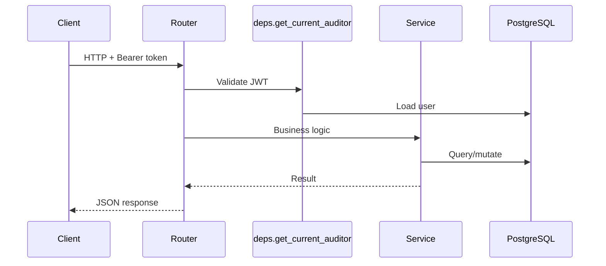

# 01 — API Architecture

## Purpose

Describe REST API design patterns, authentication, error handling, and evolution toward generic module APIs.

## Stack

| Component | Choice |
|-----------|--------|
| Framework | FastAPI 2.0.0 |
| Auth | HTTP Bearer JWT |
| Validation | Pydantic v2 schemas |
| ORM | SQLAlchemy 2.x |
| Docs | OpenAPI at `/docs`, `/redoc` |

## Request Flow



## API Design Conventions (Current)

| Pattern | Implementation |
|---------|----------------|
| Prefix | Resource-based (`/clients`, `/engagements`) |
| Module APIs | Journal at root; Revenue `/revenue/*`; Procurement `/procurement/*` |
| Project scoping | `?project_id=` query parameter on analysis endpoints |
| IDs | UUID v4 |
| Errors | `HTTPException` with `detail` string or validation object |
| Pagination | Partial: `limit`/`offset` on some list endpoints only |
| Versioning | None (implicit v2.0.0 in app metadata only) |

## Authentication

| Endpoint | Method | Auth |
|----------|--------|------|
| `/auth/register` | POST | Public |
| `/auth/login` | POST | Public |
| `/auth/refresh` | POST | Refresh token |
| `/auth/logout` | POST | Refresh token |
| `/auth/me` | GET | Bearer |
| All others | * | Bearer + `AUDITOR_PORTAL_ROLES` |

Roles in portal: `auditor`, `partner`, `manager`, `admin` (no permission differentiation today).

## Authorization (Current)

`project_access.py`:

- `get_owned_project` — traverses project → engagement → client → `user_id`
- Same pattern for client and engagement

**No organization scope. No role-based endpoint guards.**

## Error Handling (Current)

- Per-route try/except; some return raw `str(exc)` on 500
- No global exception handler
- 401 triggers frontend token refresh (`lib/api/client.ts`)

## Current Implementation

~45 endpoints across 13 routers. See [02_EXISTING_APIS.md](./02_EXISTING_APIS.md).

## Future Design

### Tenant-aware middleware

```text
Every request → TenantContext(org_id, user_id, role)
Every query → WHERE organization_id = :org_id
```

### Generic module API (Phase 3)

```text
POST /modules/{module_code}/upload?engagement_id=
POST /modules/{module_code}/run-rules
POST /modules/{module_code}/run-risk
GET  /modules/{module_code}/findings
```

Legacy routes remain as aliases during deprecation.

### Standard list pagination

```text
GET /resources?page=1&size=20&sort=created_at:desc
```

### Async jobs

```text
POST /analysis/runs → { job_id, status: "queued" }
GET  /analysis/runs/{job_id}
```

## Advantages (Current)

- FastAPI auto-generates OpenAPI
- Clear separation of routers and services
- JWT refresh pattern implemented on frontend

## Disadvantages (Current)

- Inconsistent pagination
- Triplicated module router pattern
- No API versioning for SaaS breaking changes
- Sync long-running operations in request thread

## Migration Strategy

1. Phase 1: Add org-scoped CRUD; keep existing paths
2. Phase 2: Add engagement module + governance endpoints
3. Phase 3: Generic module router behind plugin registry; proxy to existing services

## Risks

| Risk | Impact |
|------|--------|
| Missing tenant filter on new endpoint | Data leak |
| Breaking query param contracts | Frontend regression |

## Recommendations

- Add `X-Organization-Id` validation from JWT only (never from client body)
- Introduce API changelog when Phase 1 ships
- Generate TypeScript client from OpenAPI

---

*Related: [02_EXISTING_APIS.md](./02_EXISTING_APIS.md) · [03_FUTURE_GENERIC_MODULE_API.md](./03_FUTURE_GENERIC_MODULE_API.md)*
