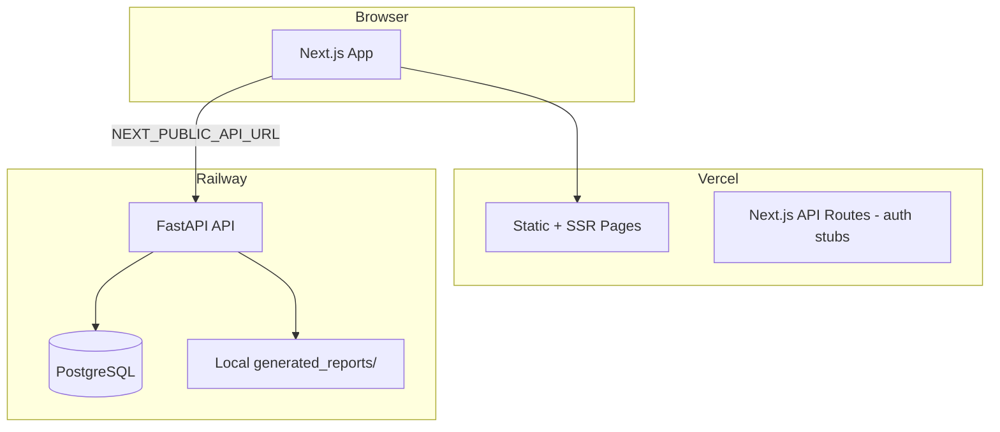

# 01 — System Architecture

## Purpose

Describe the current end-to-end system architecture of AIML_AUDIT: frontend, backend, database, deployment, and data flow for audit analytics.

## Architecture Overview

AIML_AUDIT is a full-stack audit analytics platform:

| Layer | Technology | Role |
|-------|------------|------|
| Frontend | Next.js 14, React 18, TypeScript, Tailwind CSS | Auditor portal UI |
| Backend | FastAPI 2.0, Python 3.x | REST API, rule engines, exports |
| Database | PostgreSQL | Persistent storage |
| Deploy | Vercel (frontend), Railway (backend + PostgreSQL) | Production hosting |

## Current System Diagram



## Core Data Flow (Implemented Modules)

```
Auditor Login
  → Select Client → Engagement → Project
  → Upload Excel (.xlsx)
  → Validate schema
  → Run Rules (deterministic)
  → Run Risk Scoring (weighted)
  → Generate Findings (templates)
  → Export Reports (Excel / PDF / JSON)
```

## Backend Structure

| Component | Location | Responsibility |
|-----------|----------|----------------|
| Routers | `backend/app/routers/` | HTTP endpoints (13 routers) |
| Models | `backend/app/models/audit.py` | SQLAlchemy ORM (17 tables) |
| Services | `backend/app/services/` | Business logic, rule engines |
| Schemas | `backend/app/schemas/` | Pydantic request/response |
| Migrations | `backend/alembic/versions/` | 001–006 schema evolution |
| Config | `backend/app/config.py` | Env-based settings |

## Frontend Structure

| Component | Location | Responsibility |
|-----------|----------|----------------|
| App routes | `app/` | Pages (login, dashboard, modules) |
| Components | `components/` | UI (dashboard, auth, 3 workspaces) |
| API client | `lib/api/` | Typed fetch wrappers |
| Auth | `lib/auth/` | Session, JWT, roles (client-side) |
| Module catalog | `lib/dashboard/modules.ts` | 20-module product catalog (TS) |

## Current Implementation

- **Production URLs:** App on Vercel; API on Railway
- **Auth:** JWT access + refresh tokens; bcrypt passwords
- **3 full modules:** Journal Entry, Revenue, Procurement Testing
- **Hierarchy CRUD:** Clients, Engagements, Projects
- **Rules master:** Configurable rules via PATCH `/rules/{id}`
- **Reports:** Generated to local disk; metadata in `reports` table

## Future Design

- Organization-scoped multi-tenant layer
- Blob storage (S3/R2) for reports and evidence
- Background job workers for analysis
- Generic module plugin architecture
- SSO/MFA for enterprise firms

## Advantages (Current)

- Clean separation: Next.js UI + FastAPI API
- Modular rule engines per workstream
- Alembic migrations for schema control
- Deployed and demonstrable end-to-end

## Disadvantages (Current)

- Single-user data ownership (`Client.user_id`)
- Synchronous analysis blocks HTTP requests
- Reports on ephemeral Railway disk
- Per-module router duplication (`/revenue/*`, `/procurement/*`)
- No tenant isolation for SaaS scale

## Migration Strategy

See [../database/04_MIGRATION_STRATEGY.md](../database/04_MIGRATION_STRATEGY.md) and [../roadmap/PHASE1_SAAS_FOUNDATION.md](../roadmap/PHASE1_SAAS_FOUNDATION.md).

## Risks

| Risk | Impact |
|------|--------|
| Monolith scaling | Timeouts on large uploads |
| No tenant boundary | Unsafe for multi-firm SaaS |
| Local report storage | Data loss on redeploy |

## Recommendations

1. Introduce `organizations` layer before adding more modules
2. Move report storage to object storage
3. Add job queue before scaling to 100+ firms

---

*Related: [02_SAAS_ARCHITECTURE.md](./02_SAAS_ARCHITECTURE.md) · [06_FOLDER_STRUCTURE.md](./06_FOLDER_STRUCTURE.md)*
