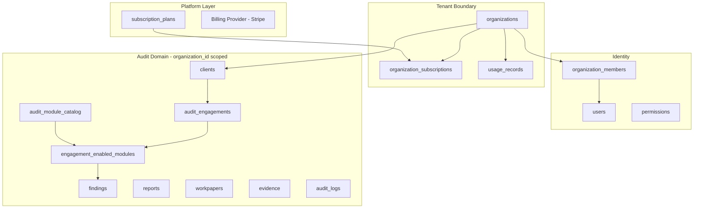

# 02 — SaaS Architecture

## Purpose

Define the target Multi-Tenant SaaS architecture for AIML_AUDIT and compare it to the current single-user implementation.

## Target SaaS Business Flow

```
Platform
  ↓
Subscription Plans (Free · Starter · Professional · Enterprise)
  ↓
Organizations (Audit Firms — TENANT)
  ↓
Users (via organization_members + roles)
  ↓
Clients (audited entities)
  ↓
Audit Engagements
  ↓
Enabled Audit Modules (from master catalog)
  ↓
Findings
  ↓
Reports
  ↓
Workpapers
  ↓
Evidence
  ↓
Audit Logs
```

## Target Architecture Diagram



## Subscription Plan Controls (Target)

Each plan defines limits for:

| Dimension | Examples |
|-----------|----------|
| Users | Max seats per organization |
| Clients | Max client records |
| Engagements | Max active engagements |
| Storage | GB for evidence + reports |
| AI Credits | Monthly LLM/analysis credits |
| Uploads | Monthly file upload count |
| Reports | Generated report quota |
| Enabled Modules | Which catalog modules are available |

## Current Implementation

| SaaS Capability | Status |
|-----------------|--------|
| Organizations table | ✗ Not implemented |
| Subscription plans | ✗ UI types only |
| Multi-user per firm | ✗ User owns clients directly |
| Tenant isolation | ✗ `Client.user_id == current_user.id` |
| Usage metering | ✗ Not implemented |
| Module entitlements | ✗ Not implemented |
| Billing integration | ✗ Not implemented |

**SaaS Readiness Score: 24 / 100**

## Future Design

- **Tenant = Organization** — every query filtered by `organization_id`
- **JWT claims** include `org_id`, `member_role`, `subscription_tier`
- **Middleware** enforces subscription limits before upload/analysis
- **Catalog in PostgreSQL** drives plan entitlements and engagement UI
- **Horizontal scale:** stateless API + worker pool + shared PostgreSQL + blob store

## Advantages (Target)

- Supports 100–10,000+ audit firms with data isolation
- Subscription-driven monetization
- Firm-wide collaboration (multiple auditors, one client list)
- Plan-based feature gating

## Disadvantages (Target)

- Higher schema and API complexity
- Migration from user-owned to org-owned data
- Billing and compliance overhead

## Migration Strategy

**Phase 1:** Add org + subscription tables; dual-write `organization_id`; switch access control.  
**Phase 2:** Engagement module enablement; deprecate user-facing projects.  
**Phase 3:** Usage metering + billing webhooks.

See [../roadmap/PHASE1_SAAS_FOUNDATION.md](../roadmap/PHASE1_SAAS_FOUNDATION.md).

## Risks

| Risk | Mitigation |
|------|------------|
| Data leak across tenants | Mandatory tenant filter in all queries; integration tests |
| Migration downtime | Dual-write period; feature flags |
| Subscription bypass | Server-side limit checks on every mutating endpoint |

## Recommendations

1. Do not onboard paying firms until Phase 1 tenant isolation is complete
2. Add `organization_id` to JWT before scaling marketing
3. Implement audit_logs early for compliance evidence

---

*Related: [03_MULTI_TENANT_ARCHITECTURE.md](./03_MULTI_TENANT_ARCHITECTURE.md) · [../business/01_SUBSCRIPTION_MODEL.md](../business/01_SUBSCRIPTION_MODEL.md)*
