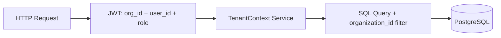

# 03 — Multi-Tenant Architecture

## Purpose

Document tenant isolation strategy for AIML_AUDIT: how audit firms are separated, how data is scoped, and how the current implementation differs from the approved target.

## Approved Decision

> Use tenant isolation. Use `organization_id` everywhere.

See [../adr/ADR-003-Tenant-Isolation.md](../adr/ADR-003-Tenant-Isolation.md).

## Target Tenant Model

| Concept | Definition |
|---------|------------|
| **Tenant** | One audit firm (organization) |
| **Tenant ID** | `organizations.id` (UUID) |
| **Isolation rule** | No query returns rows where `organization_id ≠ caller's org` |
| **Scale target** | 100 → 10,000+ organizations |

## Tenant Isolation Layers (Target)



### Layer 1 — Authentication

- User authenticates; JWT includes `organization_id` from active membership

### Layer 2 — Authorization

- `organization_members.role` determines permissions
- Engagement team membership for engagement-scoped actions

### Layer 3 — Data Access

- All domain tables carry `organization_id` (directly or via join)
- Row-level filter on every SELECT/UPDATE/DELETE

### Layer 4 — Audit

- `audit_logs` records tenant, user, action, entity, timestamp

## Current Implementation

**Model:** Single-user silo, not multi-tenant.

```python
# backend/app/services/project_access.py (conceptual)
if project.engagement.client.user_id != user.id:
    raise HTTPException(403)
```

| Aspect | Current | Target |
|--------|---------|--------|
| Tenant entity | None | `organizations` |
| Client owner | `users.id` | `organizations.id` |
| Shared firm data | Impossible | Required |
| Cross-tenant leak test | Not applicable | Mandatory CI test |

## Tables Requiring `organization_id` (Target)

| Priority | Tables |
|----------|--------|
| P1 | `clients`, `audit_engagements`, `audit_findings`, `reports` |
| P1 | All module data tables (via engagement/project lineage) |
| P2 | `workpapers`, `evidence`, `audit_logs`, `usage_records` |

**Additive only:** Keep `user_id` on clients during migration; deprecate after backfill.

## Future Design

### Shared Database, Shared Schema (Recommended)

- Single PostgreSQL cluster
- Every table filtered by `organization_id`
- Suitable for 10,000 firms at moderate scale
- Alternative (database-per-tenant) deferred unless compliance requires

### Tenant Context Service

```text
get_tenant_context(user) → Organization + MemberRole + Subscription
assert_tenant_access(entity, tenant_id)
```

## Advantages

- One codebase, one deployment, lower ops cost
- Standard SaaS pattern (Slack, Notion, etc.)
- Easier cross-tenant platform analytics (anonymized)

## Disadvantages

- Bug in filter = cross-tenant leak (mitigate with tests + middleware)
- Large tenants may need dedicated resources later

## Migration Strategy

1. Create `organizations`, backfill one org per existing user
2. Add nullable `organization_id` to `clients`; populate from user's org
3. Dual-read: accept both `user_id` and `organization_id` checks
4. Switch JWT to include `org_id`
5. Remove `user_id` ownership from new client creates
6. Add integration tests: Firm A token cannot read Firm B client UUID

## Risks

| Risk | Severity |
|------|----------|
| Missed filter on new endpoint | Critical |
| JWT without org_id | High |
| Admin impersonation without audit | High |

## Recommendations

- Implement tenant middleware before Phase 2 modules
- Never trust client-supplied `organization_id` — derive from JWT
- Add automated tenant isolation test suite in CI

---

*Related: [../adr/ADR-001-Organizations.md](../adr/ADR-001-Organizations.md) · [../database/04_MIGRATION_STRATEGY.md](../database/04_MIGRATION_STRATEGY.md)*
