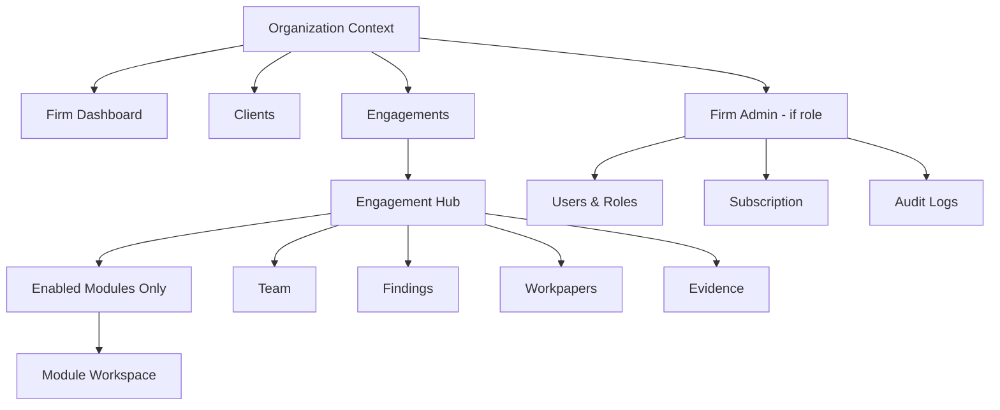

# 04 — Navigation Structure

## Purpose

Document current application navigation, information architecture, and the target engagement-centric navigation model for SaaS.

## Current Navigation (Sidebar)

Source: `lib/dashboard/navigation.ts`

| # | Label | Route | Status |
|---|-------|-------|--------|
| 1 | Dashboard | `/dashboard` | Live |
| 2 | Clients | `/dashboard/clients` | Live CRUD |
| 3 | Audit Engagements | `/dashboard/engagements` | Live CRUD |
| 4 | Audit Projects | `/dashboard/projects` | Live CRUD |
| 5 | Documents | `/dashboard/documents` | Reports list (duplicate) |
| 6 | Audit Rules | `/dashboard/rules` | Live rules editor |
| 7 | AI Audit Modules | `/dashboard/ai-modules` | Catalog + workstreams |
| 8 | Reports | `/dashboard/reports` | Live list + download |
| 9 | Settings | `/dashboard/settings` | Profile |

## AI Audit Modules Page Structure (Current)

```
/dashboard/ai-modules
├── Engagement Workstreams Panel (3 cards)
│   ├── Journal Testing → /journal-entry-testing
│   ├── Revenue Testing → /revenue-testing
│   └── Procurement Testing → /procurement-testing
└── Audit Modules Grid (20 catalog cards)
    ├── Active: Journal, Ledger Scrutiny, Duplicate Payment
    └── Coming Soon: 17 modules
```

## Module Routes (Current)

| Route | Component | Type |
|-------|-----------|------|
| `/dashboard/ai-modules/journal-entry-testing` | `JournalEntryTestingWorkspace` | Full workspace |
| `/dashboard/ai-modules/revenue-testing` | `RevenueTestingWorkspace` | Full workspace |
| `/dashboard/ai-modules/procurement-testing` | `ProcurementTestingWorkspace` | Full workspace |
| `/dashboard/ai-modules/[slug]` | Placeholder detail | Stub for active catalog slugs |
| `/dashboard/ai-modules/ledger-scrutiny` | Placeholder | Stub |
| `/dashboard/ai-modules/duplicate-payment-checking` | Placeholder | Stub |

## Current Implementation Issues (vs Target)

| Issue | Description |
|-------|-------------|
| Workstream vs catalog conflict | JE/Revenue/Procurement shown as separate workstreams AND catalog entries |
| Projects nav item | User creates `audit_projects` per type; target uses engagement module enablement |
| No org context | Navigation not scoped to organization or subscription |
| No role gating | All roles see all nav items |
| Decorative search | Dashboard header search has no handler |

## Target Navigation (Future)



### Proposed Primary Nav (Target)

| Item | Who sees it |
|------|-------------|
| Dashboard | All firm users |
| Clients | Auditor+ |
| Engagements | Auditor+ |
| Findings (cross-engagement) | Manager+ |
| Reports | Auditor+ |
| Firm Settings | Owner, Admin |
| Subscription | Owner |

**Remove from primary nav (target):** Standalone "Audit Projects" — modules live inside engagements.

## Future Design

- **Engagement hub** as central workspace after selecting an engagement
- **Module launcher** shows only modules enabled for that engagement + entitled by subscription
- **Breadcrumb:** Firm → Client → Engagement → Module → Analysis Run
- **Role-based nav:** Reviewer sees review queue; Client User sees limited portal

## Advantages (Target)

- Matches auditor mental model (work by engagement)
- Subscription can hide unavailable modules
- Reduces confusion between workstreams and catalog

## Disadvantages (Target)

- Requires UX refactor for existing users familiar with workstream cards
- Deep linking must include engagement context

## Migration Strategy

1. Phase 1: Add org admin nav (hidden behind feature flag)
2. Phase 2: Engagement hub with enabled modules
3. Phase 3: Deprecate workstreams panel; redirect old URLs to engagement-scoped routes

## Risks

- Broken bookmarks to `/revenue-testing` without engagement context
- User confusion during transition

## Recommendations

- Keep legacy routes as redirects during Phase 2
- Add engagement selector to module workspaces immediately in Phase 1

---

*Related: [05_USER_FLOW.md](./05_USER_FLOW.md) · [../business/04_ENGAGEMENT_MODEL.md](../business/04_ENGAGEMENT_MODEL.md)*
