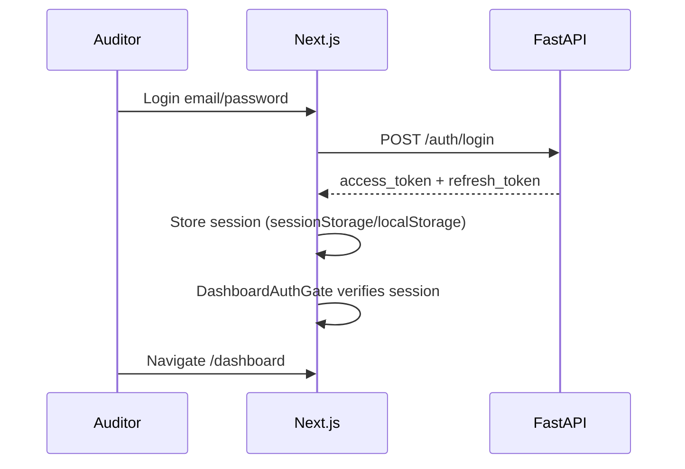
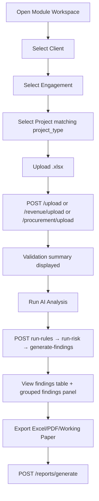
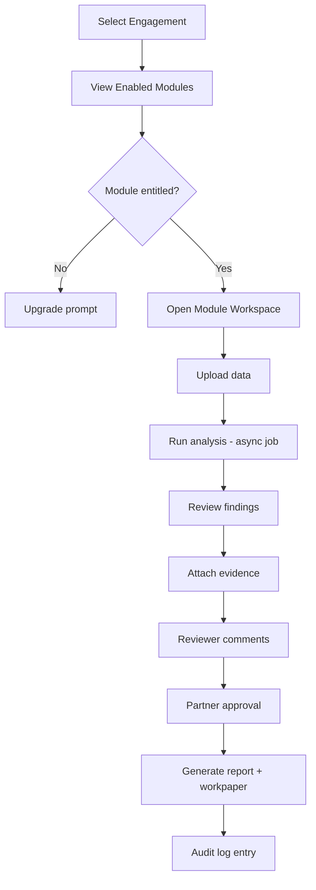

# 05 — User Flow

## Purpose

Document primary user journeys: current implemented flows and target SaaS flows.

## Current User Flow — Authentication



**Gaps:** No org selection; no MFA; no subscription check; client-side gate only (no middleware).

## Current User Flow — Module Analysis (Journal / Revenue / Procurement)



## Current User Flow — Hierarchy Management

```
Clients (CRUD) → Engagements (CRUD) → Projects (CRUD, pick project_type)
```

Seed demo creates 3 projects per engagement: Journal, Revenue, Procurement.

## Target User Flow — Firm Onboarding (Future)

```
Register → Create Organization → Select Plan → Invite Users → Create First Client
```

## Target User Flow — Engagement Execution (Future)



## User Roles — Target Flows

| Role | Primary flows |
|------|---------------|
| Organization Owner | Billing, users, firm settings |
| Partner | Engagement approval, executive dashboard |
| Audit Manager | Team assignment, module enablement |
| Senior Auditor / Auditor | Upload, run analysis, draft findings |
| Reviewer | Comment, approve findings |
| Client User | Read-only portal (limited) |
| Read Only | View reports and findings |

## Current Implementation

| Flow | Status |
|------|--------|
| Login / logout / refresh | ✓ |
| Register (creates user only) | ✓ |
| Client → engagement → project → analysis | ✓ |
| Review / approval | ✗ |
| Evidence attach | ✗ |
| Async job progress | ✗ |
| Org admin | ✗ |

## Future Design

- Engagement-centric entry point
- Background jobs with progress UI
- Finding lifecycle states in UI
- Notification on review request

## Advantages (Current Flow)

- Simple linear path for demo
- Works for single auditor pilot

## Disadvantages (Current Flow)

- Extra "project" step confuses target model
- No collaboration or sign-off
- Synchronous analysis blocks UI on large files

## Migration Strategy

- Phase 1: Org context on login; shared clients within firm
- Phase 2: Replace project selection with enabled module list on engagement
- Phase 2: Add review/approval steps to findings flow

## Risks

- Users trained on project-based flow need retraining
- Long-running analysis without job queue causes timeouts

## Recommendations

1. Document interim flow in release notes during Phase 2
2. Add async runs before marketing to large firms
3. Preserve demo credentials path for sales demos

---

*Related: [04_NAVIGATION_STRUCTURE.md](./04_NAVIGATION_STRUCTURE.md) · [../business/02_ORGANIZATION_MODEL.md](../business/02_ORGANIZATION_MODEL.md)*
