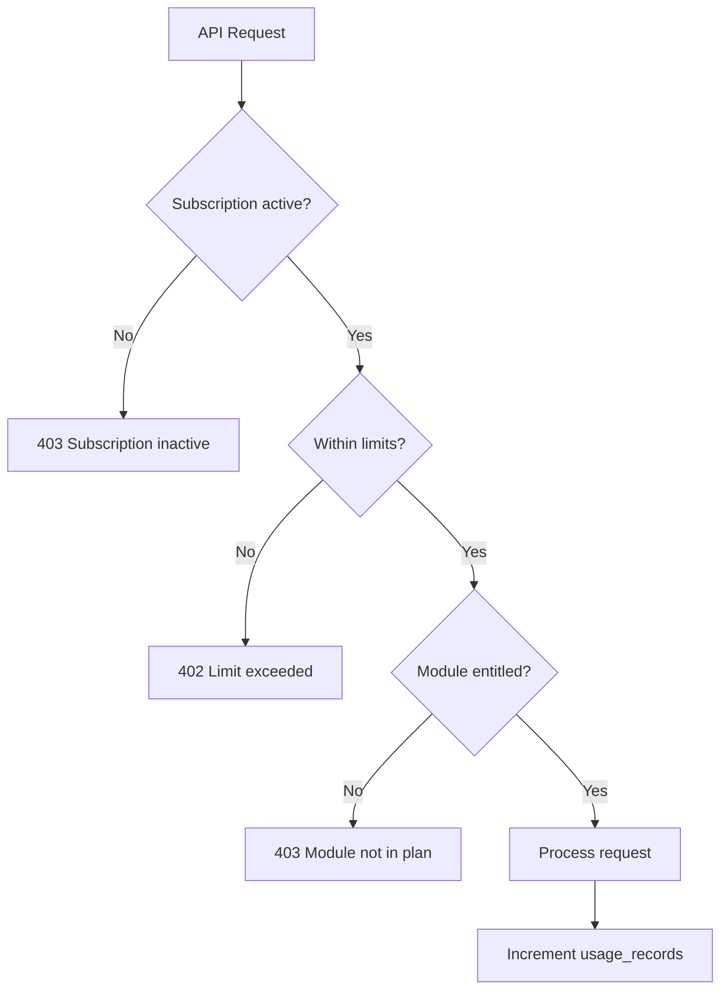

# 01 — Subscription Model

## Purpose

Define subscription plans, entitlements, limits, and how they map to the target SaaS business model.

## Target Plans

| Plan | Target segment | Firms scale |
|------|----------------|-------------|
| **Free** | Trial / solo auditor | 1–5 users |
| **Starter** | Small CA practice | 5–20 users |
| **Professional** | Mid-size firm | 20–100 users |
| **Enterprise** | Large firm / Big4-style | 100+ users, custom |

Thousands of organizations can subscribe to the same plan tier.

## Plan Controls (Target)

Each `subscription_plans` row defines:

| Limit | Description | Enforcement point |
|-------|-------------|-------------------|
| `max_users` | Seats in organization | Invite user API |
| `max_clients` | Client records | POST `/clients` |
| `max_engagements` | Active engagements | POST `/engagements` |
| `max_storage_bytes` | Evidence + reports | Upload endpoints |
| `monthly_ai_credits` | LLM / advanced analysis | AI endpoints (Phase 3) |
| `monthly_uploads` | File upload count | Module upload |
| `max_reports` | Report generations | POST `/reports/generate` |
| `enabled_module_codes` | JSON array of catalog codes | Module enable + run |
| `api_rate_limit` | Requests per minute | API gateway |
| `support_level` | email / priority / dedicated | Operational |

## Organization Subscription (Target)

```
organizations (1) ──→ (1 active) organization_subscriptions
organization_subscriptions (N) ──→ (1) subscription_plans
```

- One **active** subscription per organization
- History of past subscriptions for billing audit
- Status: `trialing`, `active`, `past_due`, `cancelled`, `expired`

## Current Implementation

| Feature | Status |
|---------|--------|
| `subscription_plans` table | ✓ (Milestone 2) |
| `organization_subscriptions` table | ✓ (Milestone 2) |
| Plan selection UI | ✓ Settings page |
| Limit definitions on plans | ✓ |
| Limit enforcement on APIs | ✗ (Milestone 8) |
| Billing provider (Stripe) | ✗ |
| Frontend `SubscriptionTier` type | ✓ (`trial`, `professional`, `enterprise`) |
| Login subscription check | ✗ (hardcoded `subscriptionValid: true`) |

## Future Design

### Enforcement flow



### Usage metering

`usage_records` table: org_id, metric, period, count, updated_at

Metrics: `uploads`, `ai_credits`, `reports`, `storage_bytes`

## Advantages

- Predictable revenue model
- Feature gating aligns with firm size
- Platform can offer free tier for acquisition

## Disadvantages

- Billing integration complexity
- Limit edge cases (grace period, overage)
- Support burden for plan changes

## Migration Strategy

1. Phase 1: Seed plans in DB; manual subscription assignment (no Stripe)
2. Phase 1: Enforce max_users and max_clients only
3. Phase 2: Add storage and upload limits
4. Phase 3: Stripe webhooks + AI credits

## Risks

| Risk | Mitigation |
|------|------------|
| Hard limits block audit deadline | Soft limits + grace for Enterprise |
| Incorrect entitlement JSON | Admin UI + validation on seed |

## Recommendations

- Start with manual subscription for pilot firms
- Professional plan enables modules 1–3 + GST + Payroll as MVP entitlement set
- Log all limit denials to `audit_logs`

---

*Related: [02_ORGANIZATION_MODEL.md](./02_ORGANIZATION_MODEL.md) · [../architecture/02_SAAS_ARCHITECTURE.md](../architecture/02_SAAS_ARCHITECTURE.md)*
