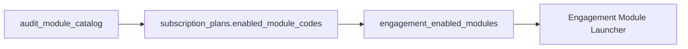

# 03 — Module Catalog

## Purpose

Define the single master catalog of 22 AI Audit Modules, implementation status, and enablement model.

## Approved Decisions

- **One catalog** — modules are not duplicated per firm
- **Store catalog in PostgreSQL** (`audit_module_catalog`)
- Journal, Revenue, Procurement are **standard catalog modules**, not separate workstreams
- Engagements **enable** modules from the catalog

See [../adr/ADR-002-Module-Catalog.md](../adr/ADR-002-Module-Catalog.md).

## Master Catalog (22 Modules)

| # | Module | Catalog code (proposed) | Status | Backend | Frontend |
|---|--------|-------------------------|--------|:---:|:---:|
| 1 | Journal Entry Testing | `JOURNAL_ENTRY_TESTING` | **Built** | ✓ | ✓ |
| 2 | Revenue Testing | `REVENUE_TESTING` | **Built** | ✓ | ✓ |
| 3 | Procurement Testing | `PROCUREMENT_TESTING` | **Built** | ✓ | ✓ |
| 4 | Ledger Scrutiny | `LEDGER_SCRUTINY` | Planned | ✗ | Stub |
| 5 | Duplicate Payment Checking | `DUPLICATE_PAYMENT` | Planned | ✗ | Stub |
| 6 | Bank Reconciliation | `BANK_RECONCILIATION` | Planned | ✗ | Coming Soon |
| 7 | Purchase Order Matching | `PO_MATCHING` | Planned | ✗ | Coming Soon |
| 8 | Vendor Invoice Validation | `VENDOR_INVOICE` | Planned | ✗ | Coming Soon |
| 9 | Expense Claim Verification | `EXPENSE_CLAIM` | Planned | ✗ | Coming Soon |
| 10 | Fixed Asset Verification | `FIXED_ASSET` | Planned | ✗ | Coming Soon |
| 11 | Depreciation Recalculation | `DEPRECIATION` | Planned | ✗ | Coming Soon |
| 12 | TDS Deduction Checking | `TDS_CHECKING` | Planned | ✗ | Coming Soon |
| 13 | GST Mismatch Checking | `GST_MISMATCH` | Planned | ✗ | Coming Soon |
| 14 | GST Input Tax Credit Validation | `GST_ITC` | Planned | ✗ | Coming Soon |
| 15 | Customer Balance Confirmation | `CUSTOMER_BALANCE` | Planned | ✗ | Coming Soon |
| 16 | Payroll Audit Checking | `PAYROLL` | Planned | ✗ | Coming Soon |
| 17 | User Access Review | `USER_ACCESS` | Planned | ✗ | Coming Soon |
| 18 | Segregation of Duties | `SOD` | Planned | ✗ | Coming Soon |
| 19 | Compliance Checklist | `COMPLIANCE` | Planned | ✗ | Coming Soon |
| 20 | Supporting Document Matching | `DOC_MATCHING` | Planned | ✗ | Coming Soon |
| 21 | Exception Report Preparation | `EXCEPTION_REPORT` | Planned | ✗ | Coming Soon |
| 22 | Invoice Checking | `INVOICE_CHECKING` | Planned | ✗ | Coming Soon |

**Note:** Frontend `lib/dashboard/modules.ts` currently lists **20 modules** (no Inventory; Revenue/Procurement not listed as catalog #2/#3). Reconcile to 22 rows in DB seed.

## Implemented Rules (Modules 1–3)

### Journal (7 rules)

`LARGE_VALUE`, `YEAR_END`, `ROUND_AMOUNT`, `WEEKEND`, `SUSPENSE_ACCOUNT`, `MANUAL_JOURNAL`, `UNUSUAL_POSTING`

### Revenue (7 rules)

`REV_DUPLICATE_INVOICE`, `REV_CUTOFF`, `REV_GST_MISMATCH`, `REV_ROUND_AMOUNT`, `REV_HIGH_VALUE`, `REV_MISSING_GSTIN`, `REV_UNPAID_LARGE`

### Procurement (7 rules)

`PROC_DUPLICATE_PAYMENT`, `PROC_MISSING_PO`, `PROC_GST_MISMATCH`, `PROC_HIGH_VALUE`, `PROC_ROUND_AMOUNT`, `PROC_MISSING_GSTIN`, `PROC_CUTOFF`

## Module Enablement (Target)

**Rule:** Module visible in engagement only if:

1. In catalog
2. Entitled by organization's plan
3. Enabled by manager on engagement

## Current vs Target UX

| Current | Target |
|---------|--------|
| AI Modules page shows 3 workstream cards + 20 grid cards | Engagement hub shows enabled modules only |
| User picks `audit_projects` by type | User picks enabled module on engagement |
| Separate routes `/revenue-testing` | Route `/engagements/{id}/modules/REVENUE_TESTING` |

## Every Module Should Support (Target)

Upload · Rule Engine · AI Analysis · Risk Scoring · Findings · Workpapers · Evidence · Review · Approval · Reports · Audit Logs · Version History · Executive Summary · AI Recommendations

**Current modules 1–3 support:** Upload, rules, risk, findings, basic reports only.

## Future Design

`audit_module_catalog` columns:

- `code`, `name`, `description`, `category`
- `implementation_status`: `built`, `beta`, `planned`
- `required_columns` JSONB (upload schema)
- `rule_pack_id` (future)

## Advantages

- Single source of truth for product and billing
- Plan entitlements reference catalog codes
- Consistent module metadata for UI

## Disadvantages

- Migration from workstream mental model
- Catalog maintenance as product grows

## Migration Strategy

1. Seed 22 rows in Phase 1
2. Map `project_type` → catalog code
3. Frontend reads catalog from API (replace `modules.ts` over time)
4. Remove workstreams panel in Phase 2

## Risks

| Risk | Mitigation |
|------|------------|
| Code mismatch TS vs DB | DB is authoritative |
| Partial module built | `implementation_status` gates UI |

## Recommendations

- Do not add module 4 until catalog + registry exist
- Group catalog by category in engagement UI (GL, AP, Tax, IT)

---

*Related: [04_ENGAGEMENT_MODEL.md](./04_ENGAGEMENT_MODEL.md) · [../api/03_FUTURE_GENERIC_MODULE_API.md](../api/03_FUTURE_GENERIC_MODULE_API.md)*
