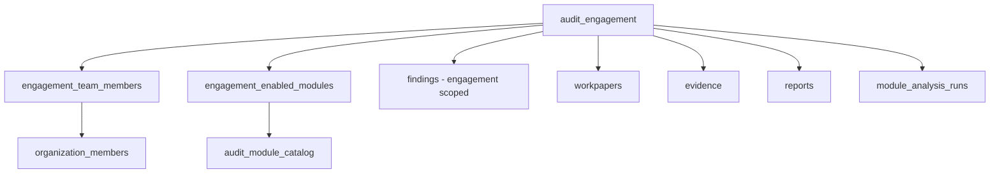

# 04 — Engagement Model

## Purpose

Define audit engagements, team assignment, module enablement, and lifecycle in the target SaaS architecture.

## Engagement Definition

An **audit engagement** is a distinct audit assignment for a client:

- FY2025 Statutory Audit
- FY2025 Internal Audit
- FY2025 GST Audit

Each engagement is **independent** with its own team, enabled modules, findings, and deliverables.

## Current Implementation

### Schema (`audit_engagements`)

| Field | Purpose |
|-------|---------|
| `client_id` | Parent client |
| `financial_year` | e.g. "FY 2024-25" |
| `audit_type` | e.g. "Statutory" |
| `status` | `planned`, `active`, etc. |
| `start_date`, `end_date` | Audit period |
| `financial_year_end` | FY end date |
| `large_value_threshold` | JE rule threshold |

### Child entities (current)

- `audit_projects` (1+ per engagement, one per module type in seed)
- Findings/reports indirectly via projects

### Gaps vs target

| Target feature | Current |
|----------------|---------|
| Assigned team | ✗ |
| Enabled modules (catalog) | ✗ (via projects instead) |
| Engagement-level findings rollup | ✗ |
| Workpapers / evidence | ✗ |
| Status workflow (Draft → Closed) | Basic status string only |
| `organization_id` | ✗ |

## Target Engagement Model



### Engagement fields (target additions)

| Field | Purpose |
|-------|---------|
| `organization_id` | Tenant scope |
| `status` | `draft`, `planning`, `fieldwork`, `review`, `approved`, `closed` |
| `assigned_partner_id` | Signing partner |
| `materiality_json` | Performance materiality settings |

### Team assignment (target)

`engagement_team_members`:

- `engagement_id`, `user_id`, `role` (lead, senior, reviewer)
- Controls who can upload vs approve on this engagement

### Module enablement (target)

Example: FY2025 Statutory Audit for ABC Manufacturing

| Module | Enabled |
|--------|:---:|
| Journal Entry Testing | ✓ |
| Revenue Testing | ✓ |
| Procurement Testing | ✓ |
| GST Mismatch Checking | ✓ |
| Payroll Audit Checking | ✓ |
| Bank Reconciliation | ✗ |

Only enabled modules appear in engagement workspace.

## Example Business Flow (Target)

```
ABC & Co (org)
  → ABC Manufacturing Ltd. (client)
    → FY2025 Statutory Audit (engagement)
      → Enabled: JE, Revenue, Procurement, GST, Payroll
      → Team: Partner + Manager + 2 Auditors + Reviewer
      → Run modules → Findings → Evidence → Review → Report → Close
```

## Legacy `audit_projects` (Compatibility)

**Approved:** Keep temporarily.

| Legacy | Target mapping |
|--------|----------------|
| `audit_projects` row | Legacy module instance |
| `project_type` | Maps to catalog code |
| Module data FKs | Still point to project until abstracted |

New engagements should create `engagement_enabled_modules` without requiring users to manage projects manually.

## Advantages (Target)

- Matches audit firm workflow
- One engagement, many modules, one deliverable set
- Team and SoD per engagement

## Disadvantages

- Migration from project-centric UI
- More complex engagement setup wizard

## Migration Strategy

1. Backfill `engagement_enabled_modules` from existing projects
2. Add team table in Phase 2
3. Engagement hub UI lists enabled modules
4. Hide "Audit Projects" nav when hub is stable

## Risks

| Risk | Mitigation |
|------|------------|
| Users confused during dual model | In-app banner explaining change |
| Orphan projects | Migration script links all projects to enablement rows |

## Recommendations

- Engagement wizard: pick client → FY → enable modules → assign team
- Default enable modules 1–3 for statutory audit template
- Engagement-level dashboard before module-level dashboard

---

*Related: [03_MODULE_CATALOG.md](./03_MODULE_CATALOG.md) · [../architecture/05_USER_FLOW.md](../architecture/05_USER_FLOW.md)*
