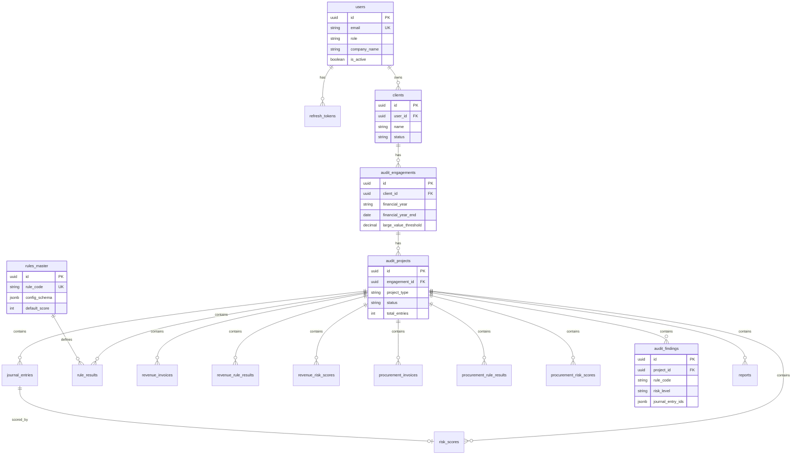
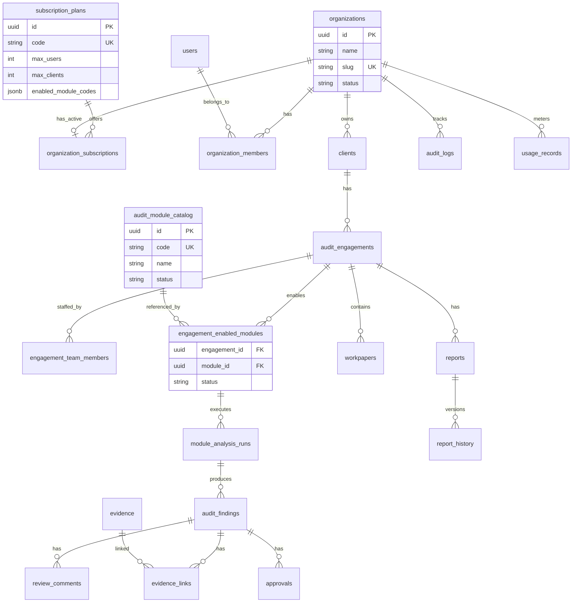

# 02 — ER Diagram

## Purpose

Logical entity-relationship diagrams for current schema and target SaaS schema.

## Current ER Diagram



## Target SaaS ER Diagram



## Relationship Summary

| From | To | Current | Target |
|------|-----|:---:|:---:|
| User | Client | 1:N direct | N:M via org |
| Organization | Client | — | 1:N |
| Engagement | Module | via project_type | N:M enablement |
| Finding | Evidence | — | N:M |
| Finding | Workpaper | — | N:1 or N:M |

## Current Implementation

- ER centered on `audit_projects` as module container
- No organization, subscription, or catalog entities in DB

## Future Design

- Engagement becomes module orchestrator
- `audit_projects` retained for legacy data reads only
- Findings linked to `module_analysis_runs` for versioning

## Migration Strategy

Map legacy relationships:

```
audit_projects.project_type  →  engagement_enabled_modules.module_code
audit_projects.id            →  module_analysis_runs.legacy_project_id (nullable)
```

## Risks

Dual model during migration (projects + enabled modules) causes confusion if not documented.

## Recommendations

Publish ER v2 before Phase 1 migration scripts are written.

---

*Related: [03_TABLE_RELATIONSHIPS.md](./03_TABLE_RELATIONSHIPS.md)*
