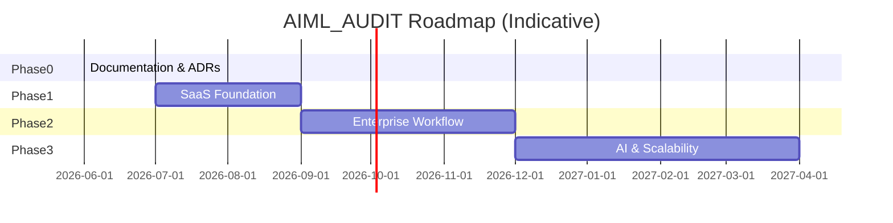

# Implementation Roadmap — Summary

## Overview

AIML_AUDIT evolves from a **single-user audit analytics MVP** to a **multi-tenant enterprise SaaS platform** through four phases. No code changes until Phase 0 is approved.



## Phase Summary

| Phase | Name | Duration | Readiness target |
|-------|------|----------|------------------|
| **0** | Architecture & Documentation | Complete | Baseline documented |
| **1** | SaaS Foundation | 10–14 weeks | SaaS ~55/100 |
| **2** | Enterprise Workflow | 10–12 weeks | Enterprise ~65/100 |
| **3** | AI & Scalability | 12–16+ weeks | Enterprise ~80+/100 |

## Detailed Phase Documents

| Phase | Document |
|-------|----------|
| 0 | [PHASE0_ARCHITECTURE.md](./PHASE0_ARCHITECTURE.md) |
| 1 | [PHASE1_SAAS_FOUNDATION.md](./PHASE1_SAAS_FOUNDATION.md) |
| 2 | [PHASE2_ENTERPRISE_WORKFLOW.md](./PHASE2_ENTERPRISE_WORKFLOW.md) |
| 3 | [PHASE3_AI_AND_SCALABILITY.md](./PHASE3_AI_AND_SCALABILITY.md) |

## What We Keep (All Phases)

- Existing 17 database tables (additive changes only)
- Journal, Revenue, Procurement rule engines and APIs
- Client → Engagement hierarchy
- JWT authentication pattern
- Next.js + FastAPI + PostgreSQL stack

## Critical Path

```
Phase 1: organizations + tenant isolation
    ↓
Phase 1: catalog in DB + engagement enablement
    ↓
Phase 2: evidence + review workflow
    ↓
Phase 3: generic module API + scale
```

## Success Metrics

| Metric | Phase 1 | Phase 2 | Phase 3 |
|--------|---------|---------|---------|
| Audit firms onboarded | 5 pilot | 50 | 500+ |
| Modules built | 3 | 3 + workflow | 10+ |
| Tenant leak incidents | 0 | 0 | 0 |
| Uptime | 99% | 99.5% | 99.9% |

## Approval Gates

| Gate | Required sign-off |
|------|-------------------|
| Start Phase 1 | Product + Tech lead |
| Start Phase 2 | Pilot firm feedback |
| Start Phase 3 | Performance baseline |
| GA Enterprise tier | Security review |

---

*See also: [../status/PROJECT_STATUS.md](../status/PROJECT_STATUS.md)*
