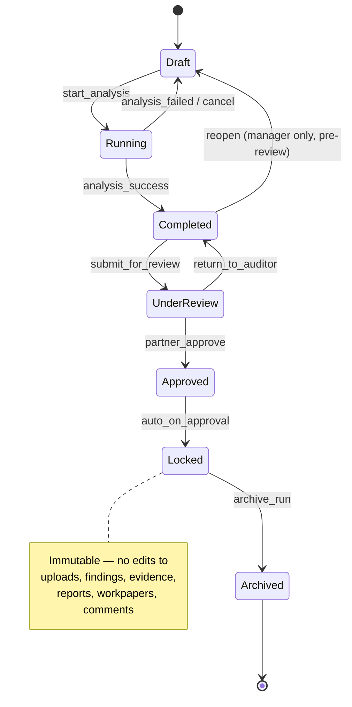
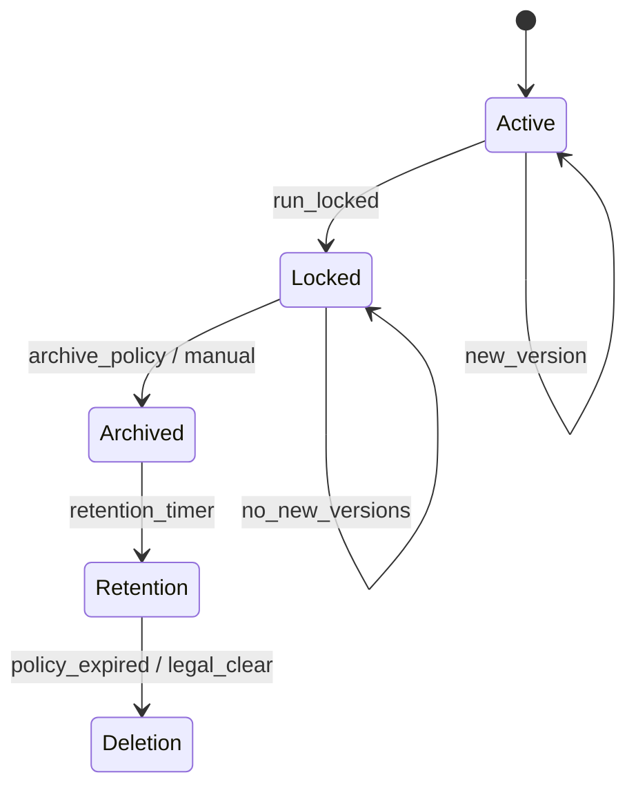
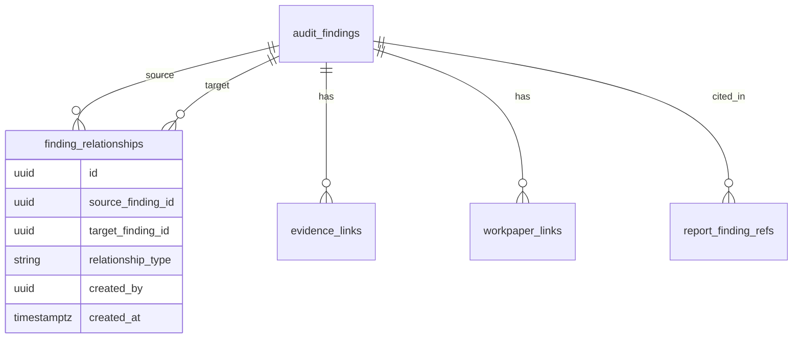

# Phase 2 — Master Implementation Guide

## Purpose

This document is the **authoritative Phase 2 implementation guide** for AIML Audit Analytics. It extends [PHASE2_ENTERPRISE_WORKFLOW.md](./PHASE2_ENTERPRISE_WORKFLOW.md) with **mandatory enterprise architecture requirements** suitable for large audit firms, large client portfolios, and dozens of catalog modules.

**Scope of this document:**

- Enterprise architecture principles and design decisions
- Analysis Run lifecycle, Official Run, locking, history, storage, concurrency, cross-module references
- Governance, scalability, performance, and future AI hooks

**Out of scope for this document:**

- Implementation code
- Database migrations
- API code
- Modifications to Phase 1

---

## Relationship to Existing Phase 2 Milestones

The milestones, database deliverables, backend deliverables, frontend deliverables, and out-of-scope items defined in [PHASE2_ENTERPRISE_WORKFLOW.md](./PHASE2_ENTERPRISE_WORKFLOW.md) **remain unchanged** and must still be delivered.

This guide **adds mandatory design principles** that all Phase 2 work must conform to. Where this guide specifies additional tables, fields, APIs, or UI behavior, implementers must incorporate them **without removing or rewriting** the original milestone list.

### Preserved Milestones (Reference — Do Not Modify)

| # | Original Phase 2 Goal |
|---|------------------------|
| 1 | Engagement team assignment |
| 2 | Evidence repository with file storage |
| 3 | Workpaper management |
| 4 | Finding lifecycle (Open → Review → Cleared/Accepted) |
| 5 | Review comments and partner approval |
| 6 | Async module analysis jobs |
| 7 | Engagement-centric module launcher |
| 8 | Consolidated engagement report |

### Preserved Database Deliverables (Reference)

`engagement_team_members`, `workpapers`, `evidence`, `evidence_links`, `review_comments`, `approvals`, `finding_status_history`, `module_analysis_runs`, `report_history`

This guide **extends** `module_analysis_runs`, `report_history`, and related entities with enterprise fields and behaviors documented below.

---

## Mandatory Design Principles (All Phase 2 Work)

1. **Engagement-centric UX** — Auditors work from Client → Engagement → Module; workspaces (legacy `audit_projects`) are auto-managed, not a primary user step.
2. **Analysis Run as the unit of work** — Uploads, rules, findings, evidence, workpapers, and reports belong to an **Analysis Run**, not loosely to an engagement or legacy project row.
3. **One Official Run per module per engagement** — Reports and dashboards default to Official Run; historical runs remain accessible.
4. **Immutability after approval** — Approved runs become **Locked**; corrections require a **New Analysis Run**.
5. **Enterprise scale by default** — Pagination, lazy loading, background jobs, blob storage lifecycle, and indexed search are required, not optional.
6. **Audit trail everywhere** — State transitions, Official Run designation, locks, and cross-module links are logged.
7. **Future AI readiness** — Schema and APIs reserve extension points for run comparison, cross-module correlation, and partner review assistance (Phase 3+; not implemented in Phase 2).

---

# Enterprise Architecture Enhancements

---

## 1. Analysis Run Lifecycle

### Overview

Every module execution on an engagement is tracked as an **Analysis Run** (`module_analysis_runs`). Runs replace the user-facing concept of manually managed audit projects while remaining compatible with legacy `audit_projects` during transition (auto-created workspace linked via `analysis_run.project_id` or `analysis_run.legacy_project_id`).

### State Diagram



### State Definitions

#### Draft

| Aspect | Specification |
|--------|----------------|
| **Purpose** | Run created; user may configure name, upload files, or prepare without executing analysis. |
| **Allowed actions** | Create run, rename, upload/replace source files, delete draft run, start analysis, assign run owner, link to module. |
| **Restricted actions** | Submit for review, approve, designate Official, generate Official report. |
| **UI behavior** | Badge: **Draft**. Primary CTA: **Upload** / **Run analysis**. Show editable run name. |
| **Database fields** | `status = 'draft'`, `started_at = NULL`, `completed_at = NULL`, `submitted_for_review_at = NULL`, `approved_at = NULL`, `locked_at = NULL`, `archived_at = NULL`. |
| **Transition rules** | → **Running** when analysis job queued/started. → **Archived** if user deletes/abandons (soft-delete policy). Multiple Draft runs allowed per module (see §7). |

#### Running

| Aspect | Specification |
|--------|----------------|
| **Purpose** | Async or synchronous analysis in progress (rules, risk, findings generation). |
| **Allowed actions** | Poll status, cancel (returns to Draft if no persisted results), view partial progress. |
| **Restricted actions** | Upload replacement files (unless job cancelled), edit findings, submit for review, approve, lock. |
| **UI behavior** | Badge: **Running** with progress indicator. Disable upload/edit. Show job ID and ETA if async. |
| **Database fields** | `status = 'running'`, `started_at = NOW()`, `job_id`, `progress_pct`, `progress_message`. |
| **Transition rules** | → **Completed** on success. → **Draft** on failure/cancel before completion. Only one **Running** run per module per engagement by default (see §7). |

#### Completed

| Aspect | Specification |
|--------|----------------|
| **Purpose** | Analysis finished; findings and reports available for auditor review and refinement before formal review. |
| **Allowed actions** | View findings, attach evidence, edit finding narrative (if not yet Under Review), generate draft reports, add workpapers, submit for review, create new run. |
| **Restricted actions** | Approve, designate Official, lock. |
| **UI behavior** | Badge: **Completed**. CTAs: **Review findings**, **Submit for review**, **Generate report (draft)**. |
| **Database fields** | `status = 'completed'`, `completed_at = NOW()`, `finding_count`, `high_risk_count` (denormalized for dashboard). |
| **Transition rules** | → **Under Review** when auditor/manager submits. → **Draft** only if manager reopens (audit log required, pre-review only). |

#### Under Review

| Aspect | Specification |
|--------|----------------|
| **Purpose** | Formal review cycle; reviewer and partner examine findings, evidence, and workpapers. |
| **Allowed actions** | Add review comments, request changes, attach evidence (reviewer), view reports, return to auditor, approve (partner only). |
| **Restricted actions** | Re-run rules on same run, replace uploads, delete findings, edit locked fields. |
| **UI behavior** | Badge: **Under Review**. Show reviewer assignment and comment thread. Partner sees **Approve** / **Return**. |
| **Database fields** | `status = 'under_review'`, `submitted_for_review_at`, `reviewer_id`, `review_started_at`. |
| **Transition rules** | → **Approved** on partner approval. → **Completed** on return to auditor (comments preserved). |

#### Approved

| Aspect | Specification |
|--------|----------------|
| **Purpose** | Partner/manager sign-off recorded; transient state before immutability lock. |
| **Allowed actions** | Designate Official Run (partner), view all artifacts, export signed report. |
| **Restricted actions** | Any mutation of run artifacts (automatically moves to Locked). |
| **UI behavior** | Badge: **Approved**. Prompt partner: **Designate as Official Run?** |
| **Database fields** | `status = 'approved'`, `approved_at`, `approved_by`, `approval_id` (FK to `approvals`). |
| **Transition rules** | → **Locked** automatically within same transaction as approval completion (see §3). |

#### Locked

| Aspect | Specification |
|--------|----------------|
| **Purpose** | Immutable audit record for regulatory and quality control. |
| **Allowed actions** | View, download reports/evidence, export audit trail, archive, compare to other runs (read-only). |
| **Restricted actions** | All mutations (uploads, findings, evidence, reports, workpapers, review comments on artifacts). |
| **UI behavior** | Badge: **Locked** with lock icon. Banner: *Additional work requires a New Analysis Run.* |
| **Database fields** | `status = 'locked'`, `locked_at`, `locked_by` (system or approver), `is_mutable = false`. |
| **Transition rules** | → **Archived** per retention/archival policy or manual archive (role-gated). |

#### Archived

| Aspect | Specification |
|--------|----------------|
| **Purpose** | Long-term retention; run visible in history but excluded from default dashboards. |
| **Allowed actions** | View metadata, restore (admin/partner, policy-gated), export audit pack, download from cold storage. |
| **Restricted actions** | All edits; cannot be Official Run while archived. |
| **UI behavior** | Hidden from default module dashboard; visible in **History** with filter **Archived**. |
| **Database fields** | `status = 'archived'`, `archived_at`, `archived_by`, `storage_tier = 'archive'`. |
| **Transition rules** | Terminal for normal workflow. **Restore** → **Locked** (admin exception only; logged). |

### Transition Authority Matrix

| Transition | Roles allowed |
|------------|----------------|
| Draft → Running | Auditor, Senior, Manager |
| Running → Completed / Draft | System (job), Manager (cancel) |
| Completed → Under Review | Auditor, Senior, Manager |
| Under Review → Approved | Partner, Manager (if delegated) |
| Under Review → Completed | Reviewer, Manager, Partner |
| Approved → Locked | System (automatic) |
| Locked → Archived | Manager, Partner, Admin |
| Designate Official | Partner only (see §2) |

---

## 2. Official Audit Run

### Business Rules

1. Each **enabled module on an engagement** may have **many** Analysis Runs over time.
2. At most **one** run per module per engagement may hold **Official** status at any time.
3. **Previous Official** is demoted to **Historical Official** (or cleared) when a new Official is designated — never deleted.
4. **Reports**, **engagement dashboard**, and **consolidated engagement report** default to **Official Run** data.
5. **New runs never auto-become Official** — designation is an explicit partner action after approval.
6. Only runs in **Approved** or **Locked** state may be designated Official.
7. A module without an Official Run shows **“No official run designated”** on dashboard; draft/latest run data may preview with watermark **“Draft — Not Official”**.

### Database Changes (Design — No Migration in This Document)

Extend `module_analysis_runs`:

| Field | Type | Purpose |
|-------|------|---------|
| `is_official` | boolean | Only one `true` per `(engagement_id, module_catalog_id)` |
| `official_designated_at` | timestamptz | When partner designated |
| `official_designated_by` | UUID FK | Partner user |
| `previous_official_run_id` | UUID FK nullable | Audit chain when superseded |

Partial unique index (design intent):

```sql
-- One official run per module per engagement
UNIQUE (engagement_id, module_catalog_id) WHERE is_official = true AND status IN ('locked', 'approved')
```

Extend `engagement_enabled_modules` (optional denormalization):

| Field | Purpose |
|-------|---------|
| `official_run_id` | Fast dashboard lookup |

### API Behavior

| Endpoint (conceptual) | Behavior |
|-----------------------|----------|
| `GET .../modules/{code}/runs` | Include `is_official`, `official_designated_at` |
| `POST .../runs/{id}/designate-official` | Partner only; validates Approved/Locked; clears prior official |
| `GET .../reports` | Default filter `run.is_official = true`; query param `?run_id=` for historical |
| `GET .../dashboard/engagement/{id}` | Module cards show Official Run summary |

### UI Behavior

- Module dashboard card: **Official Run** badge + name + approval date.
- Run history: Official row pinned at top (with Latest Run).
- Designate Official: Partner-only action on Approved/Locked run detail page.
- Confirmation modal: *“This will replace [Previous Official Name] as the official record for [Module] on [Engagement].”*

### Validation Rules

- Reject Official designation if run status ∉ {`approved`, `locked`}.
- Reject if user role ≠ Partner (or delegated `official.designate` permission).
- Reject if run is **Archived**.
- Reject if another Official designation is in progress (optimistic lock / transaction).
- Log `audit_logs` event: `analysis_run.official_designated` with prior and new run IDs.

---

## 3. Locked Runs

### Immutability Model

When a run reaches **Approved**, the system **automatically** transitions to **Locked** in the same transaction:

```
Approved → (auto) → Locked
```

### Locked Run Restrictions

| Artifact | Modify | Delete | Add |
|----------|--------|--------|-----|
| Source uploads | ✗ | ✗ | ✗ |
| Findings | ✗ | ✗ | ✗ |
| Evidence | ✗ | ✗ | ✗ |
| Reports | ✗ | ✗ | ✗ (new version on new run only) |
| Workpapers | ✗ | ✗ | ✗ |
| Review comments on artifacts | ✗ | ✗ | ✗ (read-only thread preserved) |

**Allowed on Locked runs:** View, download, export audit trail, compare runs (read-only), archive.

### Additional Work Required

Users must **Create New Analysis Run** (starts in **Draft**). Optional UX:

- **“Create follow-up run from Official”** — copies metadata and naming suggestion, **does not copy** findings/uploads (clean run).
- **“Post Adjustment Review”** — suggested name (see §6).

### Rollback and Exception Handling

| Scenario | Policy |
|----------|--------|
| Partner approved by mistake | **No unlock** in normal workflow. Partner requests **Admin Exception** → new run marked superseding; Official reassigned after re-approval. |
| System bug wrote bad data before lock | **Break-glass** Admin + audit log; incident ticket required; optional new run with corrected import. |
| Legal hold | Run stays Locked; archival deferred; `legal_hold = true` flag prevents archive/delete. |
| Unlock request (auditor) | UI shows: *“Locked runs cannot be edited. Create New Analysis Run.”* |
| Partial lock failure | Transaction rollback; run stays **Approved** until lock succeeds; alert ops. |

Database enforcement (design):

- Application-layer guards on all mutation APIs checking `run.status = 'locked' OR 'archived'`.
- Optional DB triggers denying UPDATE/DELETE on child tables when parent run locked.
- `is_mutable` denormalized flag on run for fast middleware checks.

---

## 4. Analysis Run History Management

### Default View (Module Dashboard / Engagement Hub)

Show **only**:

1. **Latest Run** — most recently created or completed (by `created_at` / `completed_at`).
2. **Official Run** — if designated (may coincide with Latest; show once with both badges).

If Latest ≠ Official, show both rows prominently.

### Expandable History

**“View all runs (N)”** expands paginated table:

| Column | Description |
|--------|-------------|
| Run name | User-defined or default (§6) |
| Status | Lifecycle badge |
| Official | ✓ if official |
| Created by | User |
| Created / Completed | Dates |
| Findings | Count |
| Risk | High/Med/Low summary |
| Actions | Open (read-only if Locked) |

### Filters

| Filter | Behavior |
|--------|----------|
| Date range | `created_at` or `completed_at` |
| Status | Multi-select lifecycle states |
| User | Created by, submitted by, approved by |
| Analysis name | Text match on `run_name` |
| Official only | `is_official = true` |
| Archived | Include/exclude archived (default exclude) |

### Search

Full-text search on:

- Run name
- Creator name
- Notes / description field
- Run sequence number (e.g. `RUN-2026-0042`)

Search indexed via PostgreSQL `tsvector` or dedicated search service at scale (see Scalability).

### UX Rules

- Default history collapsed — avoids overwhelming engagements with dozens of runs.
- Official Run **always visible** even when collapsed.
- Archived runs never appear in default dashboard counts.
- Mobile: Latest + Official only; full history on detail page.

---

## 5. Storage Lifecycle

### Storage State Diagram



### Tier Definitions

| Tier | Contents | Access | Backend |
|------|----------|--------|---------|
| **Active** | Uploads, evidence, generated reports for Draft–Completed runs | Hot storage, full CRUD (per run state) | S3/R2 standard |
| **Locked** | Immutable snapshot of all artifacts | Hot storage, read-only | S3/R2 standard + object lock (optional) |
| **Archived** | Compressed bundles per run | Warm/cold storage | S3 Glacier / R2 lifecycle |
| **Retention** | Metadata + cold archive pointer | Admin restore only | Policy-driven |
| **Deletion** | Removed per firm retention policy | None | Secure erase + audit log |

### Capabilities

| Capability | Specification |
|------------|---------------|
| **Versioning** | Object storage versioning on Active uploads; each report generation creates `report_history` row with version number. |
| **Compression** | Archive job bundles run artifacts into `.zip` or `.tar.gz` per run. |
| **Archiving** | Triggered when run → Archived or engagement closed + retention rules. |
| **Restore** | Admin restores archive to Warm tier; run status unchanged; logged. |
| **Retention policies** | Per organization: e.g. 7 years statutory; configurable by plan. |

### Scaling for Large Firms

- **Sharding by organization_id** in storage key prefix: `{org_id}/{engagement_id}/{run_id}/...`
- **Lifecycle rules** on bucket auto-transition Locked runs older than N days to Archive tier.
- **Quota enforcement** from Phase 1 subscription `max_storage_bytes` — block uploads when exceeded.
- **Deduplication** (Phase 2 optional): hash-based dedupe for identical evidence files across runs.
- **CDN** for read-only Locked/Official report downloads.

### Database Fields (Design)

On `evidence`, `reports`, upload metadata tables:

| Field | Purpose |
|-------|---------|
| `storage_tier` | active / locked / archived |
| `storage_key` | Blob path |
| `version` | Integer |
| `checksum` | SHA-256 |
| `retention_until` | Policy date |
| `archived_at` | Timestamp |

---

## 6. Analysis Run Naming Convention

### Problem

Unstructured names (`abc`, `run`, `test`) break search, history, and partner review.

### Recommended Names (User-Selectable Templates)

| Template | When to use |
|----------|-------------|
| **Initial Submission** | First run on module for engagement |
| **Client Revision 1** | After client provides updated data |
| **Client Revision 2** | Subsequent client revision |
| **Partner Review** | Run prepared specifically for partner review |
| **Final Audit** | Pre-sign-off run |
| **Post Adjustment Review** | After audit adjustments identified |
| **Re-performance** | Re-run of procedures |
| **Interim Review** | Mid-engagement checkpoint |

Users may **customize** names; templates are suggestions, not enforced literals.

### Default Naming Logic

When auto-creating a run (enable module or first open):

```
{Module Short Name} — {Suggested Template} — {FY or Engagement Label}
```

Examples:

- `Journal Entry — Initial Submission — FY 2026-27`
- `Revenue — Client Revision 1 — FY 2026-27`

**Sequence-aware defaults:**

| Condition | Default template |
|-----------|------------------|
| First run for module on engagement | Initial Submission |
| Second run | Client Revision 1 |
| Third run | Client Revision 2 |
| Run created from “Return from review” | Partner Review (suggested) |
| Run after Locked Official exists | Post Adjustment Review (suggested) |

### Validation

- Min length 3 characters; max 200.
- Warn (do not block) on generic names: `test`, `run`, `abc`, `new`, `file`.
- Unique per engagement+module **recommended** but not required (disambiguate by date in UI).

---

## 7. Concurrent Analysis Rules

### Scenario

Senior Auditor starts analysis on Journal module while Audit Manager starts another on the same module for the same engagement.

### Rules

| Rule | Default policy |
|------|----------------|
| **Maximum Running analyses** | **1** per `(engagement_id, module_code)` at a time |
| **Multiple Draft runs** | **Allowed** (up to **5** active drafts; configurable per org plan) |
| **Conflict handling** | Second start attempt returns **409 Conflict** with message: *“Analysis already running on [Run Name]. Wait or cancel.”* |
| **Duplicate upload prevention** | While Running, uploads blocked on that run; new uploads go to new Draft run |
| **Locking strategy** | Optimistic lock on `module_analysis_runs.version` column; row-level lock on start analysis |
| **Notifications** | Notify run owner when another user creates Draft on same module; notify when shared Running completes |

### Role Overrides

| Role | Override |
|------|----------|
| Audit Manager | Cancel Running run (returns to Draft or Failed) |
| Partner | View all runs; cannot force parallel Running on same module |
| Admin | Break-glass cancel (logged) |

### Cross-Module Concurrency

Running analyses on **different modules** of the same engagement: **allowed** (no limit except worker queue capacity and plan AI credits).

### Worker Queue

- Global fair-queue per organization to prevent one firm monopolizing workers.
- Priority bump for Official Run regeneration (partner-initiated only).

---

## 8. Cross-Module References

### Purpose

Findings in Journal, Revenue, and Procurement (and future modules) often relate to the same underlying issue. Phase 2 must support explicit relationships for auditor workflow and future AI correlation.

### Relationship Model



### Relationship Types

| Type | Example |
|------|---------|
| `related` | Generic related finding |
| `supports` | Evidence finding supports another |
| `contradicts` | Findings conflict — requires resolution |
| `duplicate_of` | Same issue across modules |
| `root_cause` | Root cause → symptom |
| `adjustment_impact` | JE adjustment impacts revenue recognition |

### Supported Links

| Link | Table (design) |
|------|----------------|
| Related Findings | `finding_relationships` |
| Related Evidence | `evidence_links` (extend with cross-finding) |
| Related Reports | `report_finding_refs` |
| Related Workpapers | `workpaper_links` |

### API Behavior (Conceptual)

- `POST /findings/{id}/relationships` — create link; validate same engagement (or same client with partner approval).
- `GET /findings/{id}/graph` — related findings within hop limit (default 2).
- Prevent relationships involving **Locked** findings from mutation except add read-only link (partner).

### Future AI (Reserved — Not Phase 2)

- `ai_relationship_suggestions` table stub
- `confidence_score`, `model_version`, `status = pending | accepted | rejected`
- Phase 3 AI Cross-Module Correlation consumes `finding_relationships` graph

---

## 9. Module Dashboard Improvements

### Current Gap (Phase 1)

Engagement **Modules** panel shows enable/disable only — not work status.

### Target Module Card (Engagement Hub)

Each enabled module displays:

| Field | Source |
|-------|--------|
| **Module Status** | Derived from Official Run or Latest Run lifecycle state |
| **Official Run** | Name + locked date |
| **Last Run** | Latest run name + status |
| **Last Analysis Date** | `completed_at` of latest completed run |
| **Risk Level** | Aggregate high/medium/low from Official or Latest |
| **Reviewer** | Assigned reviewer from Under Review / Approved |
| **Approval Status** | None / Under Review / Approved / Locked |
| **Pending Actions** | e.g. “Submit for review”, “Designate Official”, “Upload required” |

### Mock UI — Engagement Module Grid

```
┌─────────────────────────────────────────────────────────────────────────┐
│  FY 2026-27 Statutory — Nilgiris supermarket                            │
├─────────────────────────────────────────────────────────────────────────┤
│  Journal Entry Testing          [Official ✓] [Locked]                   │
│  Official: Final Audit — 15 Jun 2026                                      │
│  Last run: Post Adjustment Review (Draft)  •  Risk: 3 High              │
│  Reviewer: R. Sharma  •  Approval: Locked                                 │
│  ⚠ Pending: Complete Draft run or designate new Official                 │
│  [Open module]  [View history (4)]                                        │
├─────────────────────────────────────────────────────────────────────────┤
│  Revenue Testing                [No Official]                           │
│  Last run: Initial Submission (Completed)  •  28 Jun 2026                 │
│  Risk: 1 High  •  Approval: —                                              │
│  Pending: Submit for review                                               │
│  [Open module]  [View history (2)]                                        │
├─────────────────────────────────────────────────────────────────────────┤
│  Procurement Testing            [Disabled]                                │
│  [Enable module]                                                          │
└─────────────────────────────────────────────────────────────────────────┘
```

### Mock UI — Run History (Collapsed Default)

```
Journal Entry Testing — Runs
──────────────────────────
★ Official   Final Audit           Locked      12 findings   15 Jun 2026
● Latest     Post Adjustment Rev   Draft       —             29 Jun 2026
             [Show all runs (4)]  🔍 Search  📁 Filter

(Expanded)
  Client Revision 1    Locked    Archived    8 findings    01 Jun 2026
  Initial Submission   Locked    Archived    15 findings   20 May 2026
```

### Auto-Workspace (Phase 1.5 Alignment)

- Enabling a module auto-creates **Draft** Analysis Run (and linked legacy project if required).
- **Open module** navigates to Official Run if Locked; else Latest Draft/Completed run.

---

## 10. Reporting Improvements

### Principle

**Reports belong to Analysis Runs**, not directly to engagements or legacy projects.

### Report Types

| Type | Description |
|------|-------------|
| **Historical Reports** | All generated reports for any run; filterable |
| **Official Report** | Report generated from Official Run (`is_official_report = true`) |
| **Archived Reports** | Reports whose run is Archived; cold storage tier |

### Report Versioning Strategy

Each generation creates a row in `report_history`:

| Field | Purpose |
|-------|---------|
| `analysis_run_id` | Parent run |
| `version` | Monotonic per run (1, 2, 3…) |
| `report_type` | excel / pdf / working_paper / consolidated |
| `is_official_report` | True only when generated from Official Run and partner-published |
| `generated_by` | User |
| `generated_at` | Timestamp |
| `approval_status` | draft / published / superseded |
| `storage_key` | Blob path |
| `checksum` | Integrity |

**Rules:**

- Regenerating report on same run increments `version`; prior versions retained.
- **Official Report** for module = latest **published** version where `run.is_official = true`.
- Locked run: no new report versions — new run required.
- Consolidated engagement report aggregates **Official Reports** per enabled module.

### Reports Page (Target UI)

| Column | Description |
|--------|-------------|
| Module | Catalog module name |
| Analysis Run | Run name + status badge |
| Report Version | v1, v2, … |
| Generated By | User |
| Generated Date | Timestamp |
| Official Status | Official / Draft / Historical |
| Approval Status | draft / published |
| Actions | Download |

### Mock UI — Reports List

```
Module              Run                    Ver   Generated by   Date        Official   Status
Journal Entry       Final Audit (Locked)   v3    A. Kumar       15 Jun 26   ★ Official Published
Journal Entry       Final Audit (Locked)   v2    A. Kumar       14 Jun 26   Historical Superseded
Revenue             Initial Submission     v1    S. Patel       28 Jun 26   Draft      Draft
[Filter: Module ▼] [Official only ☐] [Engagement: FY 2026-27 ▼]
```

---

# Additional Architecture Sections

---

## Enterprise Governance

### Run Ownership

| Role | Ownership |
|------|-----------|
| Creator | Default `run_owner_id`; may reassign to team member |
| Engagement Lead | May reassign owner within engagement team |
| Manager | May reassign any run on engagement |
| Partner | Full visibility; designates Official |

### Audit Trail

Log to `audit_logs` (extend action types):

- `analysis_run.created`, `.started`, `.completed`, `.submitted`, `.approved`, `.locked`, `.archived`
- `analysis_run.official_designated`, `.official_revoked`
- `finding.relationship_created`
- `report.published`, `.superseded`
- `storage.archived`, `.restored`, `.deleted`

Include: `organization_id`, `engagement_id`, `run_id`, `actor_id`, `before_json`, `after_json`.

### Approval Matrix

| Action | Auditor | Senior | Manager | Reviewer | Partner |
|--------|---------|--------|---------|----------|---------|
| Create Draft run | ✓ | ✓ | ✓ | ✗ | ✓ |
| Start analysis | ✓ | ✓ | ✓ | ✗ | ✓ |
| Submit for review | ✓ | ✓ | ✓ | ✗ | ✓ |
| Approve run | ✗ | ✗ | delegate | ✗ | ✓ |
| Designate Official | ✗ | ✗ | ✗ | ✗ | ✓ |
| Archive run | ✗ | ✗ | ✓ | ✗ | ✓ |
| Break-glass unlock | ✗ | ✗ | ✗ | ✗ | Admin only |

### Segregation of Duties

- User who **approves** a run cannot be sole **creator** of same run (configurable strict mode for enterprise plan).
- Reviewer cannot approve (only partner/manager).
- Official designation requires different user than creator if strict SoD enabled.

### Permissions

Extend organization member permissions:

- `analysis_run.create`, `.start`, `.submit`, `.approve`, `.official.designate`, `.archive`
- Mapped to roles in `organization_members.role`

### Audit Logging

All governance actions immutable in `audit_logs`; no DELETE; retention aligned with §5.

---

## Scalability Strategy

### Expected Scale (Design Targets)

| Dimension | Target (Enterprise tier) |
|-----------|-------------------------|
| Clients per firm | 10,000+ |
| Engagements per firm | 50,000+ |
| Analysis Runs per engagement | 100+ (history) |
| Findings | Millions per firm |
| Evidence files | Millions; TB storage |
| Concurrent users | 500+ per firm |
| Catalog modules | 22+ (extensible) |

### Architecture Decisions

| Decision | Rationale |
|----------|-----------|
| Tenant isolation by `organization_id` | Already Phase 1; all Phase 2 tables include org FK |
| Pagination everywhere | No unbounded list APIs |
| Async analysis jobs | Celery/RQ; never block HTTP on 10k+ rows |
| Blob storage off-app-disk | S3/R2; survive redeploy |
| Denormalized dashboard counters | `engagement_module_summary` materialized view or cache |
| Read replicas (Phase 2 late / Phase 3) | Dashboard and report listing |
| Partition large tables by org or time (Phase 3) | `audit_findings`, `audit_logs` |
| Job queue per org fairness | Prevent noisy neighbor |

---

## Performance Strategy

| Technique | Application |
|-----------|-------------|
| **Lazy loading** | Run history, findings table, evidence list load on expand/scroll |
| **Pagination** | Default page size 25; max 100; cursor-based for findings |
| **Search indexing** | `tsvector` on run names; OpenSearch optional at scale |
| **Background processing** | Rules, risk, report PDF, archive compression |
| **Caching** | Redis: engagement module summary (TTL 60s); invalidate on run state change |
| **File streaming** | Download evidence/reports via signed URLs; no full file through API server |
| **Optimistic UI** | Draft run creation instant; poll Running status |
| **Connection pooling** | SQLAlchemy pool sized for worker + web tiers |

### Performance Exit Targets

- Engagement hub load < 2s P95 (50 modules enabled metadata only)
- Run history first page < 1s P95
- Findings page (500 rows) < 2s P95 with pagination
- Analysis job enqueue < 500ms

---

## Future AI Enhancements (Architecture Only — Not Phase 2 Implementation)

Reserve schema and API extension points:

| Capability | Reserved artifact |
|------------|-------------------|
| AI Comparison of Analysis Runs | `ai_run_comparisons(run_a_id, run_b_id, diff_json)` |
| AI Summary of Changes Between Runs | `ai_run_summaries` linked to comparison |
| AI Recommendation Engine | `ai_recommendations` (Phase 3 table stub) |
| AI Root Cause Analysis | Links to `finding_relationships` |
| AI Risk Trend Analysis | Time-series on run risk snapshots |
| AI Cross-Module Correlation | `ai_relationship_suggestions` |
| AI Partner Review Assistant | Read-only context from Locked Official runs |

**Phase 2 requirements:**

- Store run snapshots (finding counts, risk distribution JSON) at Completed for future diff.
- Do not call LLM in Phase 2.
- API responses include `ai_ready: true` metadata where applicable.

---

# Phase 2 Exit Criteria

### Original Exit Criteria (Preserved from PHASE2_ENTERPRISE_WORKFLOW.md)

- [ ] Auditor attaches evidence to finding
- [ ] Reviewer adds comment; partner approves
- [ ] Analysis run >10k rows completes via background job
- [ ] Reports stored in blob (survive redeploy)
- [ ] Audit log captures review actions

### Additional Enterprise Exit Criteria (Mandatory)

- [ ] **Official Run workflow** — designate, supersede, dashboard defaults to Official
- [ ] **Run lifecycle fully functional** — all states Draft through Archived with transition guards
- [ ] **Locked run protection** — mutations rejected on Locked/Archived runs; audit log on attempts
- [ ] **Historical run support** — Latest + Official default view; expandable history with filters and search
- [ ] **Report versioning** — reports tied to `analysis_run_id`; version history; Official report flag
- [ ] **Storage lifecycle** — Active → Locked → Archived tiers; retention metadata; blob not on local disk
- [ ] **Dashboard enhancements** — module cards show status, Official, Last run, risk, reviewer, pending actions
- [ ] **Auto-workspace** — no manual Add Project for auditors; Draft run auto-created on module enable/open
- [ ] **Concurrent analysis rules** — max 1 Running per module per engagement enforced
- [ ] **Cross-module finding relationships** — create/view related findings across modules
- [ ] **Naming convention** — default templates applied; warn on generic names
- [ ] **Enterprise scalability validation** — load test: 100 runs per engagement list paginated < 2s; 10k row job async; 100 concurrent users smoke test
- [ ] **Governance** — approval matrix enforced; SoD option for enterprise plan; full audit trail on run transitions

---

# Implementation Sequencing (Recommended)

This sequencing **does not replace** original milestones; it orders work for dependency clarity.

| Wave | Focus | Depends on |
|------|-------|------------|
| **2A** | `module_analysis_runs` schema + lifecycle API + auto-workspace | Phase 1 |
| **2B** | Async jobs + Locked immutability | 2A |
| **2C** | Evidence, workpapers, finding lifecycle | 2A, 2B |
| **2D** | Review, approval, Official Run | 2C |
| **2E** | Engagement hub dashboard + run history UI | 2D |
| **2F** | Report versioning + Reports page | 2D |
| **2G** | Storage lifecycle + archival jobs | 2B, 2F |
| **2H** | Cross-module relationships | 2C |
| **2I** | Scalability hardening + load validation | All |

---

# Constraints (Recap)

- Do **not** generate implementation code in this guide.
- Do **not** create database migrations in this guide (design fields documented only).
- Do **not** modify Phase 1 behavior or schema retroactively.
- **Preserve** all milestones in [PHASE2_ENTERPRISE_WORKFLOW.md](./PHASE2_ENTERPRISE_WORKFLOW.md).
- All Phase 2 implementation **must** conform to this guide.

---

*Related: [PHASE2_ENTERPRISE_WORKFLOW.md](./PHASE2_ENTERPRISE_WORKFLOW.md) · [PHASE3_AI_AND_SCALABILITY.md](./PHASE3_AI_AND_SCALABILITY.md) · [../business/04_ENGAGEMENT_MODEL.md](../business/04_ENGAGEMENT_MODEL.md)*
